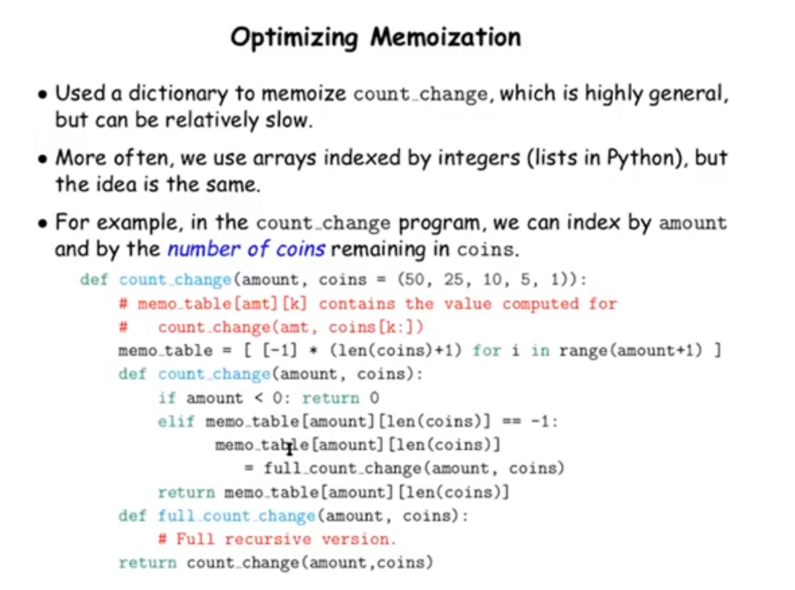
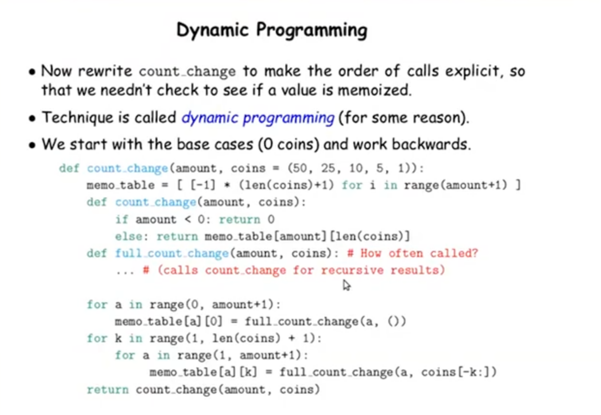
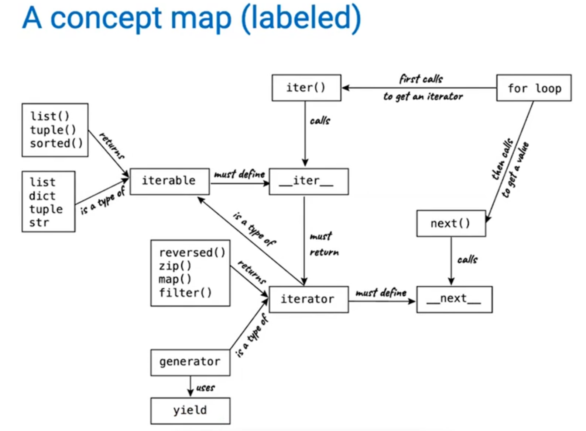

## 第一章

### 1. 介绍

这门课主要针对的是如何编程。
这门课关于什么：

1. 设计程序要做什么
2. 分析程序的表现
3. 确认程序的正确性
4. 控制复杂度

每一个编程语言都会去操控值，其中一种值是函数，表达式是计算值和计算的方式。

**语句与表达式**：Python 代码由表达式和语句组成。从广义上讲，计算机程序由指令组成，这些指令用于执行以下操作：

1. 计算一些值
2. 执行动作
语句通常描述操作。当 Python 解释器执行一个语句时，它会执行相应的操作。另一方面，表达式通常描述计算。当 Python 评估一个表达式时，它会计算该表达式的值。

**对象**：对象可以将数据和处理数据的逻辑无缝地捆绑在一起，从而管理两者的复杂性。

**解释器**： 计算复合表达式需要一个精确的程序，以可预测的方式解释代码。实现这种程序、对复合表达式进行求值的程序称为解释器。

最后，我们会发现所有这些核心概念都密切相关：函数是对象，对象是函数，而解释器则是两者的实例。不过，要掌握编程艺术，关键是要清楚地理解这些概念及其在组织代码中的作用。

学会解释错误和诊断意外错误的原因被称为**调试**。调试的一些指导原则是：

1. 逐步测试： 每一个编写良好的程序都是由可以单独测试的小型模块化组件组成的。尽快测试你编写的所有程序，以便及早发现问题，并对你的组件充满信心。
2. 隔离错误： 语句输出中的错误通常可以归咎于某个模块组件。在尝试诊断问题时，先将错误追踪到最小的代码片段，然后再尝试纠正。
3. 检查您的假设： 解释器会严格执行您的指令，不多也不少。当某些代码的行为与程序员认为（或假设）的行为不一致时，解释器的输出就会出乎意料。了解你的假设，然后将调试工作的重点放在验证你的假设是否确实成立上。
4. 咨询他人： 你并不孤单！如果你不理解错误信息，可以询问朋友、老师或搜索引擎。如果你已经找出了一个错误，但不知道如何纠正，可以请其他人帮忙看看。在集体解决问题的过程中，可以分享很多宝贵的编程知识。

### 2. 编程

每一种强大的编程语言都有以下机制：

- **原始表达式和语句**，代表了语言所提供的最简单的构件；
- **组合手段**，通过这种手段可以从较简单的元素构建出复合元素；
- **抽象手段**，通过这种手段可以将复合元素作为单元进行命名和操作。

在编程中，我们要处理两种元素：函数和数据。从形式上讲，数据是我们想要操作的东西，而函数则描述了操作数据的规则。因此，任何功能强大的编程语言都应该能够描述原始数据和原始函数，并拥有一些组合和抽象函数与数据的方法。

= 符号在 Python（以及许多其他语言）中被称为赋值运算符。赋值是我们最简单的抽象手段，因为它允许我们使用简单的名称来指代复合运算的结果，例如上面计算的面积。通过这种方式，我们可以逐步构建复杂度不断增加的计算对象，从而构建出复杂的程序。
将名称绑定到值，然后再通过名称检索这些值，这意味着解释器必须维护某种内存，以跟踪名称、值和绑定。这种内存被称为**环境**。

所以如果从一个更高的视角(抽象)去看赋值操作(=)就会发现很多设计非常合理了。

我们可以使用赋值语句为现有函数赋予新名称：
```
>>> f = max
>>> f
<built-in function max>
>>> f(2, 3, 4)
4
```

将内置名称绑定到新值：
```
>>> max = 5
>>> max
5
```
将 max 赋值给 5 后，max 名称不再与函数绑定，因此尝试调用 max(2, 3, 4) 将导致错误。

要评估一个调用表达式，Python 将执行以下操作：

1. 评估操作符和操作数子表达式，然后
2. 将操作符子表达式值的函数应用于操作数子表达式值的参数。

即使是这个简单的过程也能说明流程的一些重要问题。第一步规定，为了完成一个调用表达式的评估过程，我们必须首先评估其他表达式。因此，评估过程在本质上是递归的；也就是说，它的步骤之一是需要调用规则本身。
注意：赋值是语句，实行一个动作，而不是表达式。

#### 纯和非纯函数

**纯函数**：函数有一些输入（参数），并返回一些输出（应用函数的结果）。没有副作用，只计算来返回值。
**非纯函数**：除了返回值外，应用非纯函数还可能产生副作用，对解释器或计算机的状态造成一些改变。常见的副作用是使用 print 函数生成返回值之外的额外输出。

纯函数受到限制，不能产生副作用，也不能随时间改变行为。施加这些限制会带来很多好处。首先，纯函数可以更可靠地组成复合调用表达式。其次，纯函数往往更易于测试。参数列表总是会导致相同的返回值，可以将其与预期返回值进行比较。
纯函数对于编写并发程序至关重要，在并发程序中，多个调用表达式可以同时求值。

函数只能操作其本地环境这一事实对于创建模块化程序至关重要，在模块化程序中，纯函数只能通过它们获取和返回的值进行交互。

### 2.函数

**核心思想：把函数当作值**。

如何理解这句话?
这句话意味着函数在编程语言中拥有与任何其他数据类型（如数字、字符串、列表等）相同的地位和能力。函数被视为一种特殊的值，这是函数式编程（Functional Programming）的一个核心概念。
在编程中，值（value）是可以被存储、传递、操作和返回的对象。常见的值包括数字、字符串、列表等。在 Python 中，函数同样是一种值。这意味着函数可以像其他值一样被存储、传递、操作和返回。

在函数式编程中，函数被视为一等公民（first-class citizens），这意味着它们可以像其他值一样被处理。这种思想的核心是：

- **高阶函数**：接受函数作为参数或返回函数的函数。
- **不可变性**：尽量避免修改数据，而是通过函数返回新的值。
- **纯函数**：函数的输出只依赖于输入参数，没有副作用。

我们在 Python 中发现了一些任何功能强大的编程语言都必须具备的元素：

- 数字和算术运算是原始的内置数据值和函数。
- 嵌套函数应用提供了一种组合操作的方法。
- 将名称与值绑定提供了一种有限的抽象方法。

将函数作为值看待带来了巨大的灵活性和表达力，是现代编程中许多高级概念的基础，包括：

- **高阶函数（Higher-Order Functions）：** 能够接收函数作为参数或返回函数的函数。这是 CS 61A 中非常重要的一个主题，例如 `map`、`filter`、`reduce`。
- **抽象和模块化：** 允许你编写更通用、更可重用的代码。你可以将特定行为封装在函数中，然后将这些行为传递给其他函数，从而改变它们的行为而无需修改核心逻辑。
- **闭包（Closures）：** 当一个内部函数引用了其外部作用域的变量时，即使外部函数已经执行完毕，这些变量仍然会被保留。
- **装饰器（Decorators）：** Python 中一种修改或增强函数行为的语法糖，其底层原理就是将函数作为值传递和返回。
- **函数式编程：** 这种编程范式强调使用函数来构建程序，将函数视为核心构建块。

----

现在我们将学习函数定义，这是一种更强大的抽象技术，通过它可以将名称与复合操作绑定，然后将其称为一个单元。

- 函数名在环境图中会重复出现两次。
    - **内在名称（intrinsic name）**：这是函数自身的名字，出现在函数定义中。例如，在func square(x)中，“square”就是函数的内在名称。一个函数自身只有一个内在名称，这个名称是函数定义时确定的，用于标识这个函数本身。
    - **绑定名称（bound name）**：这是在环境的某个帧（frame）中与函数值绑定的名字。例如，如果我们在全局框架中用f = square，那么在全局框架中，“f”就是绑定到square函数的绑定名称。不同的名字可以绑定到同一个函数，但函数本身只有一个内在名称。
- 两者的区别在于：绑定名称用于在环境中引用函数，而内在名称是函数本身的标识。在程序运行过程中，我们通过绑定名称来调用函数，但函数的内在名称不会改变。

python提供三种将一个值定义到一个名字上的方法：

1. 赋值
2. 定义函数
3. 函数传参

**函数签名**：对函数形式参数的描述称为函数签名。

**匿名函数**：就是lambda函数，一般的函数是和名字绑定的，但匿名函数不是。
`lambda a, x, b: a * x + b`

#### **闭包**

```python
def outer_function():
    def inner_function():
        print("Hello from inner_function!")
    return inner_function

# 调用 outer_function 并获取返回值
my_function = outer_function()

# 调用返回的 inner_function
my_function()
```

##### 输出

```
Hello from inner_function!
```

##### 解释

1. **函数作为返回值**
   - 在 `outer_function` 中，定义了一个内部函数 `inner_function`。
   - `outer_function` 的返回值是 `inner_function` 的引用（而不是调用 `inner_function`）。
   - 当你在外部调用 `outer_function()` 时，它返回了 `inner_function` 的引用，并将这个引用赋值给变量 `my_function`。

2. **闭包的特性**
   - `inner_function` 是一个闭包（closure）。闭包是一种特殊的函数对象，它不仅包含函数的代码，还包含了函数定义时所在的作用域链。
   - 在这个例子中，`inner_function` 被定义在 `outer_function` 的局部作用域中，但它被返回到全局作用域中。
   - 尽管 `outer_function` 的调用已经结束，`inner_function` 仍然可以访问 `outer_function` 的局部作用域中的变量（如果有的话）。

3. **为什么可以在外部调用**
   - 当你将 `inner_function` 的引用赋值给 `my_function` 后，`my_function` 实际上是一个指向 `inner_function` 的引用。
   - 虽然 `inner_function` 是在局部作用域中定义的，但它的引用被保存在全局作用域中（通过 `my_function`）。
   - 因此，你可以通过 `my_function()` 来调用 `inner_function`，就好像它是一个全局函数一样。

##### 闭包的用途

闭包在 Python 中非常有用，尤其是在以下场景中：

- **封装状态**：闭包可以捕获和封装局部变量的状态，使得这些变量在函数外部仍然可以被访问。
- **回调函数**：闭包可以作为回调函数传递，同时携带一些上下文信息。
- **装饰器**：闭包是实现装饰器的基础，装饰器本质上是一个返回函数的函数。

##### 总结

- **闭包**：内部函数 `inner_function` 是一个闭包，它捕获了定义时所在的作用域。
- **引用传递**：`outer_function` 返回了 `inner_function` 的引用，这个引用被保存在全局作用域中。
- **外部调用**：通过保存的引用，可以在外部调用 `inner_function`，就好像它是一个全局函数一样。

#### 函数式抽象

尽管 sum_squares 非常简单，但它体现了用户定义函数最强大的特性。函数 sum_squares 是根据函数 square 定义的，但它仅依赖于 square 定义的其输入参数和输出值之间的关系。

我们可以编写 sum_squares, 而不必考虑如何平方一个数。关于如何计算平方的细节可以被抑制，以便以后再考虑。事实上，就 sum_squares 而言，平方并不是一个特定的函数体，而是一个函数的抽象，即所谓的函数抽象。在这个抽象层面上，任何计算平方的函数都是同样好的。

因此，仅考虑它们返回的值，任意个用于平方数的函数应该是不可区分的。每个函数都接受一个数值参数，并生成该数的平方作为值。

换句话说，函数定义应该能够抑制细节。函数的用户可能不是自己编写的函数，而是从另一个程序员那里获得的 “黑匣子”。对于另一个程序员不应该需要知道函数是如何实现的才能使用它。Python 库具有这个属性。许多开发人员使用那里定义的函数，但很少有人检查过它们的实现。

要掌握函数式抽象的使用，通常需要考虑它的三个核心属性。

1. 函数的域是它可以接受的参数集。
2. 函数的范围是它可以返回的值集。
3. 函数的意图是它计算输入和输出之间的关系 (以及它可能产生的任何副作用)。
通过函数式抽象的域、范围和意图来理解它们，对于在复杂程序中正确使用它们至关重要。

#### 好的函数设计

从根本上说，好的函数的特性都强化了函数是抽象的观念。

- 每个函数应该只有一个工作。这个工作应该可以用一个简短的名称来标识，并且可以用一行文本来表示。连续执行多个工作的函数应该分为多个函数。
- ***不要重复自己***是软件工程的一个核心原则。所谓的 DRY 原则指出，多个代码片段不应该描述冗余的逻辑。相反，这个逻辑应该被实现一次，给出一个名称，并多次应用。如果你发现自己复制和粘贴了一段代码，你可能已经找到了进行函数式抽象的机会。
- 应该对函数进行一般性定义。Python 库中没有平方方法，这是因为它是 pow 函数的一个特殊情况，pow 函数会将数字提升到任意次幂。

这些准则提高了代码的可读性，减少了错误的数量， 并且经常最小化所写代码的总量。分解一个复杂的任务将功能转化为简洁的功能是一种需要经验才能掌握的技能。幸运的是, Python提供了几个特性来支持您的工作。

##### 文档

函数定义通常包括描述函数的文档， 称为文档字符串，它必须与函数体一起缩进。 文档字符串通常用三引号括起来。第一行描述函数所做的行为。下面几行可以描述参数和描述函数的行为：

```
>>> def pressure(v, t, n):
        """Compute the pressure in pascals of an ideal gas.

		Applies the ideal gas law: http://en.wikipedia.org/wiki/Ideal_gas_law

        v -- volume of gas, in cubic meters
        t -- absolute temperature in degrees kelvin
        n -- particles of gas
        """
        k = 1.38e-23  # Boltzmann's constant
        return n * k * t / v
```

当你以函数名称作为参数调用 help 时，你会看到它的文档字符串 (键入 q 退出 Python help)。

##### 默认参数值

定义通用函数的一个后果是引入了额外的参数。具有多个参数的函数可能会导致调用困难和读取困难。

在 Python 中，我们可以为函数的参数提供默认值。当调用该函数时，具有默认值的参数是可选的。如果参数值没有提供，则默认值将被绑定到形式参数名称。

####  测试

测试驱动开发：先写出注释和测试，然后逐渐让测试可行。

测试是一种系统地执行验证的机制。测试通常采用另一个函数的形式，该函数包含对被测试函数的一个或多个样本调用。然后根据预期结果验证返回值。与大多数旨在通用的函数不同，测试涉及选择和验证具有特定参数值的调用。测试还可以作为文档：它们演示如何调用函数以及哪些参数值是合适的。

断言。程序员使用断言语句来验证期望，例如被测试函数的输出。断言语句在布尔上下文中有一个表达式，后面跟着一行引号 (单引号或双引号都可以，但要一致), 如果表达式计算结果为假值，则会显示该引号。
`assert fib(8) == 13, 'The 8th Fibonacci number should be 13'`

`fib` 的测试函数应该测试多个参数，包括 n 的极值。

```
>>> def fib_test():
        assert fib(2) == 1, 'The 2nd Fibonacci number should be 1'
        assert fib(3) == 1, 'The 3rd Fibonacci number should be 1'
        assert fib(50) == 7778742049, 'Error at the 50th Fibonacci number'
```

当在文件中而不是直接在解释器中写入 Python 时，test 通常会写入同一个文件或带有后缀 _test.py 的邻近文件中。

**文档测试**：Python 提供了一种方便的方法，可以直接在函数的文档字符串中放置简单的测试。文档字符串的第一行应该包含对函数的一行描述，后面紧跟一个空行。随后可能会有关于参数和行为的详细描述。此外，文档字符串可能包含一个调用函数的交互式会话示例：

```python
def sum_naturals(n):
        """Return the sum of the first n natural numbers.

        >>> sum_naturals(10)
        55
        >>> sum_naturals(100)
        5050
        """
        total, k = 0, 1
        while k <= n:
            total, k = total + k, k + 1
        return total
```

交互可以通过 doctest 模块进行验证。下面，globals 函数返回全局环境的表示，这是解释器评估表达式所需的。

```
>>> from doctest import testmod
>>> testmod()
TestResults(failed=0, attempted=2)
```

为了验证单个函数的 doctest 交互，我们使用了一个名为 run_docstring_examples 的 doctest 函数。它的第一个参数是要测试的函数。第二个参数应该始终是表达式 globals () 的结果，globals () 是一个返回全局环境的内置函数。第三个参数为 True, 表示我们想要 “详细” 的输出：一个运行的所有测试的目录。

```
>>> from doctest import run_docstring_examples
>>> run_docstring_examples(sum_naturals, globals(), True)
Finding tests in NoName
Trying:
    sum_naturals(10)
Expecting:
    55
ok
Trying:
    sum_naturals(100)
Expecting:
    5050
ok
```

当函数的返回值与预期结果不匹配时，run_docstring_examples 函数会将这个问题报告为测试失败。

在文件中编写 Python 时，可以通过使用 doctest 命令行选项启动 Python 来运行文件中的所有 doctest:
`python3 -m doctest <python_source_file>`

有效测试的关键是在实现新函数后立即编写 (并运行) 测试。在实现之前编写一些测试甚至是个好习惯，这样可以在脑海中留下一些示例输入和输出的印象。应用单个函数的测试称为单元测试。详尽的单元测试是良好程序设计的标志。

#### 高阶函数

为了以命名概念的形式表达某些一般模式（就是将某种模式用函数抽象出来），我们需要构造一些函数，这些函数可以接受其他函数作为参数，也可以返回函数作为值。**操纵函数的函数称为高阶函数。**

我们介绍过用户定义函数，它是一种对数字运算模式进行抽象的机制，从而使运算与所涉及的特定数字无关。有了高阶函数，我们开始看到一种更强大的抽象：一些函数表达了通用的计算方法，与它们调用的特定函数无关。

下面看一个计算黄金分割率的例子：

```python

def improve(update, close, guess=1):  #所定义的通用评估程序
	while not close(guess):
		guess = update(guess)
		return guess

def golden_update(guess):
	return 1/guess + 1

def square_close_to_successor(guess):
	return approx_eq(guess * guess,guess + 1)

def approx_eq(x, y, tolerance=1e-3):
	return abs(x - y) < tolerance
	
phi = improve(golden_update,square_close_to_successor)

```

这个例子说明了计算机科学中两个相关的重要思想。首先，命名和函数可以让我们抽象出大量的复杂性。虽然每个函数定义都很琐碎，但我们的评估程序所启动的计算过程却相当复杂。其次，正是因为我们有了一个极其通用的 Python 语言评估程序，小的组件才能组成复杂的过程。了解了程序的解释程序，我们就能验证和检查我们创建的过程。

与往常一样，我们改进的新通用方法需要一个测试来检验其正确性。黄金分割率可以提供这样一个检验，因为它也有一个精确的闭式解，我们可以将其与这个迭代结果进行比较。

```
>>> from math import sqrt
>>> phi = 1/2 + sqrt(5)/2
>>> def improve_test():
        approx_phi = improve(golden_update, square_close_to_successor)
        assert approx_eq(phi, approx_phi), 'phi differs from its approximation'

>>> improve_test()
```

对这个测试来说，没有消息就是好消息：在成功执行 assert 语句后，improve_test 返回 None。

上述示例说明了将函数作为参数传递的能力如何极大地增强了编程语言的表现力。每个一般概念或方程都映射到自己的短函数上。这种方法的一个负面影响是，全局框架中的小函数名称变得杂乱无章，而这些函数必须都是唯一的。另一个问题是，我们受到特定函数签名的限制：要改进的更新参数必须只包含一个参数。嵌套函数定义可以解决这两个问题，但需要我们丰富环境模型。

##### 嵌套函数定义

上述示例说明了将函数作为参数传递的能力如何极大地增强了编程语言的表现力。每个一般概念或方程都映射到自己的短函数上。这种方法的一个负面影响是，全局框架中的短函数名称变得杂乱无章，而这些函数必须都是唯一的。另一个问题是，我们受到特定函数签名的限制：要改进的更新参数必须只包含一个参数。嵌套函数定义可以解决这两个问题，但需要我们丰富环境模型。

我们需要对环境模型进行两项扩展，以实现词法范围界定。

1. 每个用户定义的函数都有一个父环境：即定义该函数的环境。
2. 当用户定义的函数被调用时，其本地框架会扩展其父环境。

```
>>> def average(x, y):
        return (x + y)/2

>>> def sqrt_update(x, a):
        return average(x, a/x)
```

两个参数的update函数与improve函数不兼容（update需要两个参数，而不是一个）。而且它只提供一次更新，而我们真正关心的是通过重复更新来取平方根。解决这两个问题的办法是将函数定义放在其他定义的主体中。
```
>>> def sqrt(a):
        def sqrt_update(x):
            return average(x, a/x)
        def sqrt_close(x):
            return approx_eq(x * x, a)
        return improve(sqrt_update, sqrt_close)
```

与局部赋值一样，局部 def 语句只影响当前局部框架。这些函数只有在 sqrt 被求值时才处于作用域内。与我们的求值过程一致，在调用 sqrt 之前，这些局部 def 语句甚至不会被求值。

**词法范围**。本地定义的函数也可以访问其定义的作用域中的名称绑定。在本例中，sqrt_update 引用了 a 这个名称，它是其外层函数 sqrt 的形式参数。这种嵌套定义之间共享名称的规则称为词法作用域。重要的是，内部函数可以访问其定义环境（而不是调用环境）中的名称。
```python
def average(x, y):
    return (x + y)/2

def improve(update, close, guess=1):
	while not close(guess):
		guess = update(guess)
	return guess

def approx_eq(x, y, tolerance=1e-3):
	return abs(x - y) < tolerance

def sqrt(a):
	def sqrt_update(x):
		return average(x, a/x)
	def sqrt_close(x):
		return approx_eq(x * x, a)
	return improve(sqrt_update, sqrt_close)

result = sqrt(256)
```

**扩展环境**。一个环境可以由任意长的帧链组成，最后总是以全局帧结束。通过嵌套 def 语句调用定义在其他函数中的函数，我们可以创建更长的链。这次调用 sqrt_update 的环境由三个框架组成：本地 sqrt_update 框架、定义了 sqrt_update 的 sqrt 框架（标记为 f1）以及全局框架。

因此，我们实现了 Python 中词法作用域的两个关键优势:

1. 局部函数的名称不会与定义它的函数的外部名称相冲突，因为局部函数名称将绑定在定义它的当前局部环境中，而不是全局环境中。
2. 局部函数可以访问外层函数的环境，因为局部函数的主体是在一个扩展了定义它时的评估环境的环境中进行评估的。


##### 函数作为返回值

通过创建返回值本身就是函数的函数，我们可以在程序中实现更强的表达能力。词法作用域编程语言的一个重要特点是，本地定义的函数在返回时会保持其父环境。下面的示例说明了这一特性的实用性。

一旦定义了许多简单函数，函数组合就是我们编程语言中的一种自然组合方法。也就是说，给定两个函数 f(x) 和 g(x)，我们可能想定义 h(x) = f(g(x))。

牛顿法是一种经典的迭代方法，用于寻找返回值为 0 的数学函数参数。找到函数的零点通常等同于解决其他一些感兴趣的问题，例如计算平方根。牛顿法是一种迭代改进算法：它改进了对任何可微分函数零点的猜测，这意味着它可以在任意点用直线逼近。牛顿法根据这些直线近似值来寻找函数的零点。

```
>>> def newton_update(f, df):
        def update(x):
            return x - f(x) / df(x)
        return update

>>> def find_zero(f, df):
        def near_zero(x):
            return approx_eq(f(x), 0)
        return improve(newton_update(f, df), near_zero)
```
在实验牛顿法时，请注意该方法并不总是收敛的。改进的初始猜测必须足够接近零点，而且必须满足函数的各种条件。尽管存在这一缺陷，牛顿法仍是一种强大的求解可微分方程的通用计算方法。在现代计算机中，对数和大整数除法的快速算法都采用了该技术的变体。

**柯里化**：我们可以使用高阶函数将接受多个参数的函数转换为一系列接受单个参数的函数。更具体地说，给定函数 f (x，y), 我们可以定义一个函数 g, 使得 g (x)(y) 等价于 f (x，y)。在这里，g 是一个高阶函数，它接受单个参数 x, 并返回另一个接受单个参数 y 的函数。这种转换称为柯里化。
```
>>> def curried_pow(x):
        def h(y):
            return pow(x, y)
        return h

>>> curried_pow(2)(3)
8
```

一些编程语言，如 Haskell, 只允许接受单个参数的函数，因此程序员必须柯里化所有多参数过程。在 Python 等更通用的语言中，当我们需要一个只接受单个参数的函数时，柯里化是有用的。例如，映射模式将一个单参数函数应用于一系列值。在后续章节中，我们将看到更多关于 映射模式的通用示例，但现在，我们可以在一个函数中实现该模式：

```
>>> def map_to_range(start, end, f):
        while start < end:
            print(f(start))
            start = start + 1
```

在上面的例子中，我们手动对 pow 函数执行柯里化转换以获得 curried_pow。相反，我们可以定义函数来自动执行柯里化以及逆向非柯里化转换：
```
>>> def curry2(f):
        """Return a curried version of the given two-argument function."""
        def g(x):
            def h(y):
                return f(x, y)
            return h
        return g

>>> def uncurry2(g):
        """Return a two-argument version of the given curried function."""
        def f(x, y):
            return g(x)(y)
        return f

>>> pow_curried = curry2(pow)
>>> pow_curried(2)(5)
32

>>> uncurry2(pow_curried)(2, 5)
32

```

##### Lambda表达式

注意，lambda表达式是表达式，不是完全意义上的函数。
到目前为止，每次我们想要定义一个新函数时，都需要给它起一个名字。但对于其他类型的表达式，我们不需要将中间值与名字关联起来。也就是说，我们可以计算 a*b + c*d, 而无需为子表达式 a*b 或 c*d 或整个表达式命名。在 Python 中，我们可以使用 Lambda 表达式即时创建函数值，这些表达式会计算未命名的函数。Lambda 表达式会计算一个函数，该函数的函数体只有一个返回表达式。不允许使用赋值语句和控制语句。
```
>>> def compose1(f, g):
        return lambda x: f(g(x))
```

我们可以通过构建相应的英语句子来理解 Lambda 表达式的结构：

>     lambda            x            :          f(g(x))
"A function that    takes x    and returns     f(g(x))"

##### 第一类函数

作为程序员，我们应该对识别程序中潜在抽象的机会保持警惕，基于它们进行构建，并将其泛化，以创建更强大的抽象。这并不是说一个人总是应该以尽可能抽象的方式编写程序；专业程序员知道如何选择适合他们任务的抽象级别。但重要的是能够从这些抽象的角度思考，这样我们就可以准备好在新的上下文中应用它们。高阶函数的重要性在于，它们使我们能够在编程语言中明确地将这些抽象表示为元素，这样它们就可以像其他计算元素一样被处理。

总的来说，编程语言对计算元素的操作方式施加了限制。限制最少的元素被认为具有一等地位。一等元素的一些 “权利和特权” 包括：

- 它们可能与名称相关联。
- 它们可以作为参数传递给函数。
- 它们可以作为函数的结果返回。
- 它们可以包含在数据结构中。

Python 授予函数完全一等地位，由此带来的表达能力提升是巨大的。

##### 函数装饰器

Python 提供了特殊的语法，用于在执行 def 语句 (称为装饰器) 时应用高阶函数。最常见的例子可能是 trace。
```
>>> def trace(fn):
        def wrapped(x):
            print('-> ', fn, '(', x, ')')
            return fn(x)
        return wrapped

>>> @trace
    def triple(x):
        return 3 * x

>>> triple(12)
->  <function triple at 0x102a39848> ( 12 )
36
```

在这个例子中，定义了一个高阶函数 trace, 该函数返回一个函数，该函数在调用其参数之前使用打印语句输出参数。三重函数的 def 语句包含一个 @trace 注释，这影响了 def 的执行规则。像往常一样，创建了函数 triple。然而，名称 triple 并没有绑定到这个函数。相反，名称 triple 绑定到了新定义的 triple 函数上调用 trace 的返回函数值。在代码中，这个装饰器等价于：
```
>>> def triple(x):
        return 3 * x

>>> 	triple = trace(triple) #注意这里，最初的triple定义被装饰器更新掉了
```
----

**注意：函数内的赋值永远只看当前环境帧，也就是第一帧**。

```python
def f(x):
	def g(y):
		x = y    #不会改变f中的x，只会在g的环境中改变
	g(4)
	return x

print(f(3))
```

#### 递归

***注意***：*只有在需要将递归变成尾递归时，才需要写辅助函数进行递归。*

**函数的哲学**：作为调用者，只需要关注函数的功能，而不用关心内部的实现，这在递归中很重要。将递归调用视为函数抽象被称为递归信念的飞跃。我们根据函数本身定义函数，但只需要相信更简单的情况在验证函数的正确性时会正确工作。
所以，最好先想清楚，什么情况下进行递归，什么情况下进行当前的操作。

##### 线性递归

下面看一个例子：

```python
def sum_squares(N):
	"""Return The sum of  K**2 for K from 1 to N"""
	if N < 1:
		return 0
	else:
		#return sum of K**2 for K from 1 to N-1 + N**2
		#这里sum_squares(N-1)的功能就是sum of K**2 for K from 1 to N-1
		return sum_squares(N-1) + N**2
```

所有形如`sum_squares()`的函数功能必须服从`Return The sum of  K**2 for K from 1 to N`这个注释。

很多时候，我们会将自己代入机器去一行一行分析代码来分析递归，但实际上不要这么做。应该像函数哲学一样，应该依赖于函数文档，而不是每次需要使用一个函数思考函数将如何做它应该做的，并跟踪它。

**防止无限递归**：要给一个递归确定一个下界，要让递归的参数（不一定是数值）能够感受到它在”缩短“，并且在到达这个下界时终止。

#### 异常

可以使用异常来进行防御性编程，来确保函数能做正确的事情。在python中，可以创造一个异常值和用`raise`引发它。

assert断言是对raise的外包装，`assert False`和`raise AssertionError()`会产生同样的效果。断言错误一般表示发生了非常糟糕的事情。

当你预期了一个错误可能发生，可以使用`try`语句来捕获异常。

```python
try:
	input = open(myfile).read()
except FileNotFoundError:
		print("Warning: could not open", myfile)
		input = ""

```

---

#### 尾递归是什么？

首先，我们来回顾一下尾递归。**尾递归**是指在一个函数的最后一步操作中，返回的表达式就是对自身的递归调用。

一个非尾递归的例子（Python）：

```Python
def factorial(n):
    # 最后一步是乘法操作，不是递归调用本身
    if n == 1:
        return 1
    else:
        return n * factorial(n - 1)
```

在这个例子中，`factorial(n-1)` 返回后，还要进行一次乘法运算。这导致函数在递归调用返回前，必须**保留当前调用的状态**（`n` 的值），并将这些状态保存在调用栈中。当 `n` 很大时，这会导致栈溢出。

---

##### 尾递归的实现和辅助函数

为了将非尾递归转变为尾递归，我们需要将所有状态和中间结果作为参数，在递归调用中传递下去。这就需要引入一个**辅助函数 (Helper Function)**。

这个辅助函数通常包含一个额外的参数，用于保存**累积的结果 (accumulator)**。这样，每次递归调用时，它都会将当前的结果更新并传递给下一次调用，从而使得递归调用成为**函数的最后一步**。

**一个尾递归的例子（Python 伪代码）**：

Python

```
def factorial_tail(n):
    # 主函数，调用辅助函数并提供初始状态
    return factorial_helper(n, 1)

def factorial_helper(n, accumulator):
    # 辅助函数，包含了递归逻辑和状态
    if n == 1:
        # 递归的最后一步，直接返回累积的结果
        return accumulator
    else:
        # 最后一步操作就是对自身的递归调用，没有其他操作
        # 将中间结果 n * accumulator 作为参数传递给下一次调用
        return factorial_helper(n - 1, n * accumulator)
```

在上面的例子中，`factorial_helper` 就是那个辅助函数。它包含了递归的核心逻辑，并用 `accumulator` 参数来保存中间结果。`factorial_tail` 主函数则只负责初始化这个过程。

---

##### 为什么只有在尾递归时才需要辅助函数？

1. **管理状态：** 尾递归的核心在于**将状态作为参数传递**。当一个函数需要进行复杂的、带状态的递归时，将累积的状态封装在辅助函数的参数中，比在主函数中处理要清晰得多。主函数（`factorial_tail`）只定义了“是什么”（求阶乘），而辅助函数（`factorial_helper`）定义了“如何做”（带状态的递归过程）。
2. **清晰的职责分离：** 主函数提供一个简洁、易于使用的外部接口。它对外部调用者隐藏了递归实现的复杂性。调用者只需传入 `n`，而无需关心 `accumulator` 的初始值。这种设计模式符合**抽象**的思想。
3. **语言特性：** 在支持尾递归优化的语言（如 Scheme、某些 Haskell 编译器）中，编译器会识别出这种模式，并将其优化为简单的循环，从而避免栈溢出。显式地使用一个辅助函数来构造尾递归，是向编译器或解释器“声明”：“嘿，这是一个可以被优化的尾递归！”

### 总结

总结以下，写函数的以下步骤：

1. 先写函数文档，确定函数的定义域和值域，并描述出来。就是输入的范围是什么，我要得到什么样的输出。
2. 1. 描述一个过程，该过程使用简单的步骤从输入计算输出。
3. 写测试文档，进行测试。
4. 进行防御性编程，确定函数正确的输入，对非法输入进行防御。
5. 设计你的函数

不要将所有功能写到一个函数里，也不要重复代码，如果写函数时想到这里需要某个功能，使用函数。

## 面向对象

本章聚焦于数据，在计算机中，编程所经常做的一件事是将一个现实世界中的概念使用数据表示出来，对于现实世界的一辆汽车，我们需要思考如何用能够使用的数据来表示。

使用复合抽象化使我们能够提高程序的模块化程度。将程序中处理数据表示方式的部分与处理数据操作方式的部分分离开来的一般技术是一种强大的设计方法，称为数据抽象化。数据抽象化使程序的设计、维护和修改变得更加容易。

数据抽象化在性质上类似于函数式抽象。当我们创建函数式抽象时，可以抑制函数实现的细节，并且特定函数本身可以被任何具有相同整体行为的其他函数替换。换句话说，我们可以创建一个抽象，将函数的使用方式与函数实现的细节分离。类似地，数据抽象将复合数据值的使用方式与其构造的细节分离。

数据抽象化的基本思想是将程序结构化，使其能够处理抽象数据。也就是说，我们的程序应该以这样的方式使用数据，即尽可能少地对数据做出假设。同时，将具体的数据表示定义为程序的独立部分。

程序的这两个部分，即操作抽象数据的部分和定义具体表示的部分，通过一小组函数连接起来，这些函数根据具体表示实现抽象数据。

**注意**：*不要违反抽象*。

---

在 CS 61A 中，**违反抽象**（Violating Abstraction）是指你在编写程序时，**依赖了抽象层内部的实现细节，而不是仅仅依赖其定义的接口或行为契约**。这通常会导致代码变得脆弱、难以维护和扩展。

在 CS 61A 中，这个概念主要体现在 **数据抽象** (Data Abstraction) 和 **过程抽象** (Procedural Abstraction) 中。

**违反数据抽象 (Violating Data Abstraction)：**

数据抽象的目标是**将数据的表示与其使用分离开来**。当你定义了一个抽象数据类型 (Abstract Data Type, ADT) 时，你提供了一组操作（构造函数和选择函数），用户只能通过这些操作来创建和访问数据。

**违反数据抽象的行为，就是直接去访问或修改底层数据的具体结构，而不是通过选择函数。**

举个 CS 61A 常见的例子：**有理数 (Rational Numbers)**。

假设你定义了一个有理数抽象，它由一个分子和一个分母组成。你可能会像这样实现它（CS 61A 中常用的列表表示）：


```Python
# 数据抽象的构造函数 (Constructor)
def make_rational(numer, denom):
    """构造一个有理数 (numer/denom)"""
    # 假设这里做了约分等处理
    return [numer, denom]

# 数据抽象的选择函数 (Selectors)
def get_numer(rational):
    """获取有理数的分子"""
    return rational[0]

def get_denom(rational):
    """获取有理数的分母"""
    return rational[1]

# 数据抽象的操作 (Operations)
def add_rational(r1, r2):
    """添加两个有理数"""
    # 这是一个使用选择函数的好例子
    new_numer = get_numer(r1) * get_denom(r2) + get_numer(r2) * get_denom(r1)
    new_denom = get_denom(r1) * get_denom(r2)
    return make_rational(new_numer, new_denom)
```

**违反数据抽象的例子：**

一个典型的违反数据抽象的行为是，当你需要获取一个有理数的分子时，直接写成 `my_rational[0]`，而不是使用 `get_numer(my_rational)`。


```Python
r = make_rational(3, 4)

# 这是好的行为：通过选择函数访问
numerator = get_numer(r)
print(numerator) # 3

# 这是违反抽象的行为：直接访问底层实现细节
# 你在假设有理数就是用一个列表表示的，并且分子是列表的第一个元素
bad_numerator = r[0]
print(bad_numerator) # 3
```

**为什么这是违反抽象？**

设想一下，如果未来你决定改变有理数的内部实现方式，比如从列表改为元组，或者用自定义的对象：

```Python
# 新的有理数实现方式 (使用元组)
def make_rational_v2(numer, denom):
    return (numer, denom)

def get_numer_v2(rational):
    return rational[0] # 仍然是索引0，但类型变了

def get_denom_v2(rational):
    return rational[1] # 仍然是索引1，但类型变了
```

如果你在代码中处处都使用了 `r[0]` 来获取分子，那么当你切换到 `make_rational_v2` 时，所有使用 `r[0]` 的地方都必须手动修改，这会导致大量的工作和错误。

但如果你始终使用 `get_numer(r)`，那么你只需要修改 `get_numer` 函数内部的实现即可，所有调用 `get_numer` 的代码都无需改动。这就是抽象的强大之处：**它允许你在不影响使用者的前提下改变底层实现。**

**违反过程抽象 (Violating Procedural Abstraction)**

过程抽象是指将一系列操作封装成一个独立的函数，并给它一个清晰的、描述性的名称。用户只需要知道这个函数的作用和如何调用它，而不需要了解它内部的具体实现步骤。

**违反过程抽象的行为，就是不依赖函数的契约（它做什么），而是依赖它内部是如何做的。**

例如，如果你有一个 `sort_list(my_list)` 函数。违反抽象的行为可能是你假设这个函数会使用特定的排序算法（比如快速排序），然后基于这个假设去推断它的时间复杂度或内存使用，而不是仅仅依赖它“将列表排序”这个承诺。

在 CS 61A 中，更常见的形式可能是：

- **复制粘贴代码而不是提取为函数：** 如果你发现一段相同的逻辑在多个地方出现，但没有将其封装成一个函数，那么你就是在重复实现，而不是利用过程抽象来重用和简化代码。
- **不使用已有的抽象：** 当一个问题可以用已有的高阶函数（如 `map`, `filter`）或你之前定义的抽象数据类型来解决时，却选择重新从头实现细节。

在 CS 61A 中，理解和避免违反抽象是学习如何编写**健壮、可维护和可扩展**的程序的关键一步。这要求你：

1. **始终通过定义的接口（构造函数和选择函数）来操作抽象数据，而不是直接访问其内部表示。**
2. **信任函数所提供的契约，只关注它做什么，而不去依赖它具体是怎么做的。**

这样做，你的代码会变得更加模块化，并且能够更好地应对未来可能发生的改变。

---

### 序列
序列由一堆变量组成，序列有以下几种性质：

1. 无限或有限
2. 可变或不可变
3. 可索引或不可索引
4. 可迭代
可索引指的是可以使用下标来访问，比如说`A[1]`这种。而不是所有序列都是可索引的，也可以是可迭代的，可以依次取序列中的每个元素后再来处理。

python的序列：

1. 元组tuple
2. 列表list
3. 字符串string
4. range()
5. iterator迭代器
6. generator生成器

**选择**：通过索引提取序列中的某个元素，python的所有序列都是可索引的。
**切片**：从一个序列中去除一部分创建一个新的序列。

有时候，我们会发现一个函数返回了一个元组，为什么？这样可以进行连续赋值。`x,y = (1, 9)`，等号右边一定是一个序列，并序列中的元素数量必须和左边列出来的一样。获得这样的元组列表的一个方法是`zip()`。`zip()`像一个拉链一样把两个列表的元组对应位置组合起来。

```
>>> list(zip([1,2,5,6],[6,3,7,1]))
[(1,6), (2,3), (5,7), (6,1)]
```

注意：`zip()`返回的是序列，一个生成器。

#### 列表

列表是可变序列，有很多奇特的操作。
```
>>> L
[1, 9, 8, 4, 5]
>>> L[2:4] = []     #delete
>>> L
[1, 9, 5]

>>> L[1:1] = [2,3,4,5]     #in idx 1 but contain 1,insert a list
>>> L
[1, 2, 3, 4, 5, 9, 5]

>>> L[len(L) : ] = [10, 11]    #append a list
>>> L
[1, 2, 3, 4, 5, 9, 5, 10, 11]

>>> L[0:0] = range(-3,0)   #prepending
>>> L
[-3, -2, -1, 1, 2, 3, 4, 5, 9, 5, 10, 11]
```

注意到一个python特性，正交性，也就是最后的那个例子，任何序列可以在赋值右边使用，能把两个合理的特性放在一起使用。

**列表解析式：`[<expression> for <var> in <sequence expression> if <boolean expression> ]`。一个在列表中的表达式语法，用来生成一个列表。


### 非序列抽象数据类型

#### 字典

字典是键值对的可变映射。

字典的规则：

1. 键不能是可变类型，键必须是不可变类型。
2. 所有键必须不一样。每个键只能有一个值。
3. 值可以是任意类型。

迭代字典：有很多种迭代字典的方法。

将字典看作列表进行迭代。

```python
insects = {"spiders": 8, "centipedes": 100, "bees": 6}
for name in insects:
	print(insects[name])
	#按照被加入字典的顺序进行迭代
#与下面等价
for name in list(insects):
	print(insects[name])
	#按照被加入字典的顺序进行迭代

```

```python
>>> insects = {"spiders": 8, "centipedes": 100, "bees": 6}
>>> list(insects)
['spiders', 'centipedes', 'bees']
```

### 突变

**非破坏性操作和破坏性操作**：一个操作作用到一个对象上，如果没有改变这个对象那就是非破坏性的，如果改变了，这个对象在某个程度上发生了变化，那就是破坏性的。

可变性和不可变性：不可变值是一旦创建就不会改变的，可变值相反，注意可变值是能够原地改变，如果要改变不可变值，一般是重新创建一个改变后的对象，而原来的仍不变。

区分：`list.append()`和`list.extend()`方法并不相同。append只添加一个元素，而且将这个元素作为整体添加进去，但extend参数是一个可迭代的对象，将多个这种对象迭代添加。

```python
s = [2,3]
t = [5, 6]
s.append(4)
s.append(t)

s.extend(4)    #error
s.extend(t)
```

### 对象的同一性和内容的相等

同一性：就是同一个对象，`exp0 is exp1`得到真值，说明这两个是同一个对象。
相等性：`exp0 == exp1`，得到真值说明这两个表达式或者说对象有相同的值。

在没有特定的理由的情况下，使用`is`来替换`==`是有风险的。在数字和字符串这种不可变的对象中使用`is`可能会造成意想不到的结果，python有时候会优化内存，所以不要在数字和字符串中使用`is`。

#### 作用域

python中不能允许函数重新赋值全局作用域中的名字。
```python
current = 0
def count():
	#global current
	current = current + 1
	print("Count:", current)

count()
count()

```
这里代码错误的原因是，在局部作用域中使用了一个未赋值的变量。python在看到创建局部的新current变量，那么就不会向上层作用域查找变量，而current未赋值又被引用了，所以出现错误。

我们可以使用`global`关键字明确让python重新赋值全局变量。但是**在函数中使用全局变量并不好，我们要尽量避免，会产生副作用**。应该做的是将全局变量作为参数传递给函数。尽量避免使用`global`和`nonglobal`关键字。

### 迭代器

迭代器是能够逐个访问值的对象。我们可以使用迭代器来遍历可迭代对象的结果。
```python
toppings = ["","",""]
topperator = iter(toppings)
```
toppings是一个可迭代对象，对它使用`iter()`就可以获得一个迭代器。`next()`是一个全局内建函数，对迭代器使用会得到序列中的下一个元素。一旦没有元素剩下的情况，对迭代器使用`next()`会得到`StopIteration`的异常。

如何知道一个对象是否是可迭代的？
可以查看这个对象是否有`__iter__`方法和`__next__`方法。 

对于一个通用的迭代器，使用while循环并捕获迭代结束的异常。
```python
ranked_chocolates = ("Dark", "milk", "White")
chocolaterator = iter(ranked_chocolates)    #iter()实际上调用ranked_chocolates.__iter__()方法

try:
	while True:
	choce = next(chocolaterator)
	print(choce)
except StopIteration:
	print("No more left!")
```

但实际上，下面我们通常使用的for循环来进行迭代是一个语法糖，实际上就是上面的while循环。
```python
ranked_chocolates = ("Dark", "milk", "White")
for chocolate in ranked_chocolates:
	print(chocolate)
```

一些返回迭代器的函数：

 - `reversed(sequence)`以相反的顺序迭代。
 - `zip(*iterables)`像拉链一样将每个列表对应位置的相关元素组合在一起。
 - `map(func, iterable, ···)`为迭代器中的每个对象调用func。和列表解析式的功能基本相同。
 - `filter(func, iterable)`过滤迭代器，看是否满足func的要求。和`[x for x in iterable if func(x)]`功能一样。

*在迭代器下面改变可迭代对象是危险的*。

### 生成器

生成器是能够从生成器函数中产生的迭代器。在生成器函数中惰性生成值。通过`yield`来生成一个值，在给出`yield`之后暂停函数，然后再重新启动函数。

```python
def evens():
	num = 0
	while num < 10:
		yield num
		num += 2

```
为什么要生成器？
因为生成器很懒，在碰到处理大量输入的时候，这是非常有用的，只有在需要时才会生成下一项。

`yield from`是一个语法糖。等价于

```python
def a_then_b(a, b):
	for item in a:
		yield item
	for item in b:
		yield item

def a_then_b(a, b):
	yield from a
	yield from b
```

`yield from` 的作用就是简化这种“在生成器内部迭代另一个生成器并逐个产生值”的模式。
它本质上是做了三件事：

1. **自动迭代子生成器：** 它会迭代 `yield from` 后面跟着的表达式（称为**子迭代器**或 **subiterator**），并把子迭代器产生的所有值直接传递给 `yield from` 所在的生成器的调用者（称为**调用者**或 **caller**）。
    
2. **传递 `send()` 方法的值：** 如果调用者通过 `send()` 方法向委托生成器发送了值，这些值会直接传递给子迭代器。
    
3. **处理异常和 `return` 值：** 如果子迭代器抛出了异常，这个异常会传递给委托生成器。如果子迭代器通过 `return` 返回了一个值（在生成器中 `return` 语句会引发 `StopIteration` 异常，并将返回值作为 `StopIteration` 的 `value` 属性），这个值会被 `yield from` 表达式捕获。

### 面向对象编程

类是定义新数据类型的模板，类的实例称为对象。面向对象编程将数据和动作结合在一起形成对象。每个对象拥有的函数属性就是方法。

注意一下，python的创建类属性和C++的不一样，python直接在`__init__()`方法中创建并且初始化属性。类方法第一个参数都是self，也就是对象本身。一个绑定方法绑定了函数和调用这个函数的对象。
`class_name(args)`为构造函数，调用会构造一个新对象，会调用类的`__init__()`方法，新对象是init方法的第一个参数。
在不是__init__()函数的类方法中声明类属性也可以。

**类变量**：这是在类中而不是在方法中的赋值，那么对于某个对象来说，这个变量不在实例中，而在类中，访问某个实例的类变量会向上查找，看是否是实例中的成员变量，如果不是，就去类变量中查找。主要用于让一些对象共享某一点。当一个子类继承自一个父类时，它会自动获得父类的所有属性和方法，这包括类变量。
这意味着子类和其实例可以通过点运算符 (`.`) 直接访问父类中定义的类变量，就好像这些变量是它们自己定义的一样。如果直接通过**子类名**来修改继承的类变量，Python 不会修改父类中的原始类变量。相反，它会在子类中**创建（或覆盖）一个同名的新类变量**，从而**遮蔽 (shadow) 或隐藏**了父类的同名变量。其他兄弟子类或父类自身不受影响。
如果通过**实例**尝试修改类变量，Python 会在**该实例上**创建一个同名的**实例变量**。这个实例变量会遮蔽类变量，意味着后续通过该实例访问同名属性时，会优先找到实例变量。这不会影响类变量本身，也不会影响其他实例。

python对于属性的访问非常随意，可以任意访问属性，甚至使用一个不存在的属性会自动创建它，所以使用`_`声明希望这个变量是私有的，但是python依旧允许使用，只不过把自觉性交给程序员自己。

格式化字符串：`f"We have {self._inventory} bars`。可以直接在括号中引用变量。

#### 继承

继承的主要概念不多说了，主要记录一下python中的特性。
有时候在子类中重构方法时，仍需要调用父类的方法，可以使用`super()`。
```python
	super().eat(food)
	#这两个等价
	Animal.eat(self, food)  #Animal是当前的父类
```
调用超类的函数通常在`__init__()`中常使用。

python中可以进行多重继承，也就是一个类继承多个父类，但是不推荐这样做，这样的话，继承关系会变得非常复杂，重写方法要非常小心。

#### 组合

指的是对象由其他对象组成，说白了就是一个对象实例中有很多其他对象实例，一个对象的属性是别的对象。拥有多个相同方法的对象的好处是，可以用相同的方法处理这些对象，实际上，可以对一大堆子类调用同一个函数，即使他们不是同一个类。

继承是is-a的关系，组合式has-a的关系。

`dir()`函数返回一个对象所拥有的所有属性列表。
`__repr__()` 的主要目标是为**开发者**提供一个清晰、无歧义的对象表示。它的返回值通常是一个字符串，该字符串描述了创建对象的代码，该字符串如果作为 Python 代码被执行，**能够重新创建出该对象（或至少是一个等价的对象）**。使用`eval()`对`__repr__()`函数的返回值求值，会执行创建出此对象。

在python中时常出现不确定是否一个对象有没有某个方法的情况，可以使用`getattr(bunny, "ears_hang_low", False)`函数来确定，如果没有，会返回第三个参数的默认值。`hasattr()`可以检查是否一个对象有某个属性。
`getattr`和`.`运算符实际上都在背后调用了`__getattr__`方法。

在类内部的方法中，给属性赋值通常不会触发__setattr__方法，而会触发__getattribute__方法。这是因为在方法中，属性赋值操作实际上是对属性进行访问，然后调用属性的__set__方法来完成赋值过程。

python的列表实现是动态数组，内存连续的存储方式，但为什么python允许使用混合元素类型的列表？
因为事实上python没有存储值，存储的是对象的引用，理解为箭头。
递归处理链表的一般模式是：基本情况是空链表，递归情况是通过处理rest来分解。



上面的记忆化需要确定他们发生的顺序，可以提前做好，不需要提前测试以确保一切都是可用的，以固定的顺序提前计算之后查表。


#### 泛型

如果能传递不同类型的参数，并从中得到相同功能的结果，那就是泛型函数。python提供了非常多的方法让我们可以在python中用泛型语法自定义类，它鼓励你把所有的对象变成像鸭子一样的东西。
鸭子类型，如果一个东西行为像鸭子，叫起来也像鸭子，那么就可以把它当作鸭子运行。
鸭子测试：去测试一个对象的行为而不是类型，被称为鸭子测试。



### 总结

多态性：

1. 一个函数可以运行在不同类的对象上。
2. 鸭子类型，一个通用性的函数能够运行在任何具有特定行为方式的对象上。
3. 类型强制转换，一个函数可以转换参数来达到自己想要的类型。
4. 类型分派，函数检查参数类型来选择正确的行为。

## Scheme

函数式编程只用“表达式”，不用“语句”。

“表达式”（expression）是一个单纯的运算过程，总是有返回值；“语句”（statement）是执行某种操作，没有返回值。函数式编程要求，只使用表达式，不使用语句。也就是说，每一步都是单纯的运算，而且都有返回值。

原因是函数式编程的开发动机，一开始就是为了处理运算（computation），不考虑系统的读写（I/O）。”语句”属于对系统的读写操作，所以就被排斥在外。  
当然，实际应用中，不做I/O是不可能的。因此，编程过程中，函数式编程只要求把I/O限制到最小，不要有不必要的读写行为，保持计算过程的单纯性。

Scheme是一门早期的编程语言Lisp的一个方言，对于一个语言，必须了解这种编程语言操纵的值是什么，将Scheme数据分为两种，一种原子数据和一种是对数据。
Lisp早期是用来处理符号数据的，
这门语言有一个非常有意思的特性：Scheme程序就是Scheme数据，这意味着在执行Scheme程序是特别容易。
这些程序的基本情况是所有的原子值，大部分的list代表了Scheme程序中的函数调用。

### Scheme 语言基础

这一部分介绍了 Scheme 这种函数式编程语言的基本语法和特性，与 Python 形成了对比：

- **Lisp 方言：** Scheme 是 Lisp 家族的一员，其核心特点是**极简的语法**和**同像性（homoiconicity）**，即代码和数据结构（列表）有着相同的表示形式。
- **前缀表示法：** 所有操作符都放在操作数前面，并用括号括起来。例如，`( + 2 3 )`。
- **S-表达式：** Scheme 程序由 S-表达式（S-expressions）构成，它们可以是原子（数字、符号）或列表（嵌套的 S-表达式）。
- **特殊形式 (Special Forms)：** 区别于普通函数调用，特殊形式在求值时有独特的规则，例如 `if`、`define`、`lambda` 等。它们不先求值所有参数。
- **求值规则 (Evaluation Rules)：** 强调 Scheme 的求值模型，包括如何求值基本表达式、组合式（函数调用）、特殊形式等。
- **高阶函数 (Higher-Order Functions)：** Scheme 强调函数是“头等公民”，可以作为参数传递、作为返回值返回，从而实现更抽象和灵活的代码。`lambda` 表达式用于创建匿名函数。

---

#### 1. 序列操作与 ADT

这部分关注如何用 Scheme 处理序列数据，并引入了抽象数据类型（Abstract Data Types, ADTs）的概念。

- **列表作为基本序列结构：** Scheme 中列表是核心的序列数据结构，通过 `cons`（构造）、`car`（取头）、`cdr`（取尾）等基本操作来构建和操作。
- **递归处理序列：** 强调递归是 Scheme 中处理列表和序列的常用且自然的方式。
- **抽象数据类型 (ADT)：** 讲解如何通过选择函数（selectors）和构造函数（constructors）来定义 ADT，从而将数据表示与其使用分离开来。这使得数据结构在底层实现变化时，使用它的代码无需修改。例如，用 `cons`、`car`、`cdr` 来实现一对数据，而用户只通过 `make-pair`、`first`、`second` 来使用。

---

#### 2. 环境模型与求值过程

这是第三章最核心的部分，深入解释了 Scheme 代码是如何被解释器求值的，特别是关于变量绑定和作用域的规则。

- **帧 (Frames) 和环境 (Environments)：** 解释器使用环境模型来管理变量绑定。一个**环境**由一系列**帧**组成，每个帧是一个从变量名到值的映射。
- **查找规则：** 当查找一个变量的值时，解释器会从当前帧开始，沿着环境链向上查找，直到找到第一个匹配的绑定。
- **定义 (Definitions) 与赋值 (Assignments)：**
    - `define` 用于创建新的变量绑定或修改当前帧中的现有绑定（如果存在）。
    - `set!` 用于修改**环境链中已存在的**变量绑定。如果没有找到绑定，则报错。
- **过程应用 (Procedure Application)：** 解释函数调用时，会创建一个新的环境帧，其中包含形式参数到实际参数值的绑定，并将这个新帧链接到定义函数时的环境（**闭包**的概念）。
- **闭包 (Closures)：** 函数在被定义时（而不是被调用时）“记住”它所处的环境。当函数被调用时，它会基于这个记住的环境（而非调用时的环境）来查找非局部变量。这是 Scheme（以及 Python）中词法作用域（Lexical Scoping）的核心。
    

---

#### 3. 解释器与元语言抽象

这部分是将前面所有概念串联起来，构建一个简单 Scheme 解释器的概念。

- **解释器的结构：** 解释器通常包含两个核心部分：
    
    - **求值器 (Evaluator)：** 负责根据语言的求值规则来计算表达式的值。
        
    - **应用器 (Applier)：** 负责将过程（函数）应用于它们的参数。
        
- **元语言抽象 (Metalinguistic Abstraction)：** 指的是使用一种语言（如 Scheme）来描述或实现另一种语言（或同一语言的一个子集）。通过编写一个 Scheme 解释器，我们不仅理解了 Scheme 语言本身，更理解了**语言的本质**和**解释器的工作原理**。这是一种强大的抽象工具。
    

---

### 计算器

#### 1. 从表达式到结果：解析与求值

计算器部分的核心任务是：给定一个字符串形式的数学表达式（例如 `"2 + 3 * 4"`），如何让程序理解它并计算出结果？这涉及到两个主要阶段：

- **解析 (Parsing)：** 将输入的字符串表达式，从人类可读的形式转换成计算机更容易处理的**结构化表示**，通常是**表达式树 (Expression Tree)** 或 **抽象语法树 (Abstract Syntax Tree, AST)**。
    
    - **词法分析 (Lexical Analysis / Tokenization)：** 原始字符串首先被分解成一系列有意义的“词法单元”或“标记”（Tokens）。例如，`"2 + 3 * 4"` 会被分解为 `2` (数字), `+` (运算符), `3` (数字), `*` (运算符), `4` (数字)。**在 Scheme 中：** 想象一个 Scheme 解释器接收一个字符串，比如 `(+ 2 (* 3 4))`。词法分析器会把它分解成 `(`, `+`, `2`, `(`, `*`, `3`, `4`, `)`, `)` 这些独立的符号和数字。
        
    - **语法分析 (Syntactic Analysis)：** 词法单元流根据预定义的语法规则（例如，运算符优先级、结合性）被组织成一个树形结构，通常是**抽象语法树 (Abstract Syntax Tree, AST)**。它验证代码是否符合语言的语法规则。对于 `"2 + 3 * 4"`，其表达式树的根节点会是 `+`，因为 `*` 的优先级更高，它会先被计算。**在 Scheme 中：** Scheme 的 S-表达式天生就是一种抽象语法树的形式。`( + 2 ( * 3 4 ) )` 这个 S-表达式本身就已经是一个树形结构。编译器会根据语言的语法规则，将标记流构建成 AST。AST 是程序的一种标准化、结构化的表示，后续的语义分析、优化和代码生成都基于 AST 进行。CS 61A 中的求值器直接操作这种 S-表达式形式的程序结构。
        
        ```
              +
             / \
            2   *
               / \
              3   4
        ```
	- **语义分析 (Semantic Analysis)：**
    
    - **作用：** 在 AST 的基础上，检查程序的语义正确性（例如，变量是否已定义、类型是否匹配等），并收集类型信息。
        
    - **在 Scheme 中：** 在 Scheme 解释器中，这部分检查通常与求值过程交织在一起。例如，在查找变量时（环境模型），如果找不到绑定，就会抛出未定义变量的错误。函数调用时，也会检查参数数量是否正确。
        
    - **与编译的关系：** 编译器在这个阶段会进行各种检查，确保程序的含义是明确和合法的。例如，如果 `+` 运算符被应用于一个数字和一个列表，编译器会在此时报错（或生成运行时检查）。

- **求值 (Evaluation)：** 遍历这个表达式树，根据树的结构和节点的含义（数字、运算符），递归地计算出最终的结果。
    
    - 对于叶子节点（数字），直接返回其值。
        
    - 对于操作符节点，首先递归地求值其子表达式，然后将求得的值应用相应的操作符。
        

---

#### 2. 表达式树 (Expression Tree)

计算器部分会重点讲解如何构建和操作表达式树。

- **表示：** 在 Python 中，表达式树通常可以用嵌套的列表或自定义类来表示。例如，`(‘+’, 2, (‘*’, 3, 4))` 就可以表示上述表达式树。
    
- **作用：** 表达式树清晰地表达了运算符的优先级和表达式的结构，使得求值过程变得直接和递归。
    

---

#### 3. 操作符的优先级和结合性

这是解析阶段的关键挑战，决定了表达式树的正确结构：

- **优先级 (Precedence)：** 不同的操作符有不同的优先级（例如，乘法和除法通常高于加法和减法）。解析器必须知道这一点，才能正确地分组操作。
    
- **结合性 (Associativity)：** 当多个相同优先级的操作符连续出现时（例如 `2 - 3 - 4` 或 `2 / 3 / 4`），结合性决定了它们的计算顺序（左结合或右结合）。例如，大多数算术运算符都是左结合的，`2 - 3 - 4` 等同于 `(2 - 3) - 4`。
    

---

#### 4. 抽象数据类型 (ADT) 与接口

尽管可能没有直接提到“ADT”这个词，但计算器部分无疑在实践中运用了 ADT 的思想：

- **分离表示与行为：** 你会学习如何定义操作符、数字等抽象概念的接口，而不是直接操作底层的列表索引或字符串。例如，你可能会有 `make_operand(value)`、`is_operator(exp)`、`operator_name(exp)`、`operands(exp)` 等辅助函数来操作表达式树，而不需要知道它底层是用列表还是其他结构实现的。这使得代码更模块化，更易于理解和维护。
    

---

#### 5. 错误处理

一个健壮的计算器还需要考虑如何处理无效的输入：

- **语法错误：** 例如，括号不匹配、非法字符、运算符使用不当。
    
- **运行时错误：** 例如，除数为零。
    
- 通常会通过抛出自定义的异常来指示这些错误。
    


---

好的，我们继续深入 CS 61A 第三章关于 Scheme 语言和解释计算机程序的内容。虽然 CS 61A 的重点是**解释器 (Interpreter)** 而非完整的编译器，但它确实触及了一些与编译相关的概念，尤其是在**语言处理**和**程序表示**的层面。

#### 5. 语言处理的阶段（广义上的“编译”）


        
4. **中间代码生成 (Intermediate Code Generation)：**
    
    - **作用：** 将 AST 转换成一种更接近机器语言但仍独立于具体机器的中间表示（例如，三地址码、字节码）。
        
    - **在 Scheme 中：** CS 61A 的解释器通常不会显式地生成一个独立的中间代码层。它直接操作 S-表达式（作为 AST 的一种形式）并在求值时即时解释执行。然而，**Scheme 代码本身就可以看作是一种非常高层的“中间代码”**，因为它结构化且接近程序的逻辑。
        
    - **与编译的关系：** 这是编译器中一个重要的优化点。中间代码可以进行平台无关的优化，提高代码效率。
        
5. **代码优化 (Code Optimization)：**
    
    - **作用：** 对中间代码进行各种转换，以提高程序的执行效率（更快、更小）。
        
    - **在 Scheme 中：** CS 61A 的解释器通常不涉及复杂的代码优化。它更侧重于语言的语义和求值过程的理解。但在现实世界的 Scheme 或 Lisp 实现中，优化是非常重要的，例如**尾递归优化 (Tail-Call Optimization, TCO)**。
        
        - **尾递归优化：** 这是函数式语言（特别是 Scheme）编译器或高级解释器的一个关键优化点。如果一个函数的所有递归调用都是**尾调用**（即递归调用是函数的最后一步操作，其返回值直接作为函数的返回值），那么编译器可以将递归调用转换为迭代，避免栈溢出。CS 61A 会详细解释尾递归的概念，以及它如何让递归成为一种强大的、等同于循环的控制结构。
            
    - **与编译的关系：** 编译器在此阶段尝试使生成的机器代码更高效。
        
6. **目标代码生成 (Target Code Generation)：**
    
    - **作用：** 将中间代码翻译成特定目标机器（CPU）的机器码或汇编代码。
        
    - **在 Scheme 中：** CS 61A 中的解释器直接在运行时求值 S-表达式，不生成机器码。它本身就是用 Python 或 Scheme 实现的“软件 CPU”。
        
    - **与编译的关系：** 这是编译过程的最终阶段，生成可直接执行的二进制文件。
        

### 总结编译相关内容

尽管 CS 61A 的第三章主要教授的是**解释器的工作原理**，但它通过 Scheme 的 S-表达式形式、环境模型和求值过程，隐式地触及了编译理论中的几个关键概念：

- **程序表示：** Scheme 的 S-表达式是程序的一种**结构化表示**，类似于编译器内部的 AST。
    
- **语义检查：** 变量查找、类型匹配等在求值时进行，这与编译器的语义分析阶段类似。
    
- **求值策略：** 对于普通组合式和特殊形式的不同求值规则，是所有语言处理的关键。
    
- **尾递归优化：** 虽然解释器可能不一定实现所有优化，但尾递归的概念是函数式语言的重要特性，它模糊了编译优化和语言语义之间的界限。


### Macros

实际上，函数和类的定义通过添加命令和数据类型来拓展语言，但语言没办法定义新的控制结构。
许多语言提供了宏。宏可以允许你来去定义一个能够生成程序文本的函数。实际上，调用一个宏函数就是将一段程序文本中的变量进行替换了。
C的宏不作为程序语言的一部分，而是由预处理器来提供的。而Scheme中的宏是语言的一部分，Scheme中，宏不进行参数计算，自动的将返回值作为Scheme表达式并且执行它。Scheme中有一个语法是Quasiquote，能够使列表表达像python中的f字符串。
宏可以帮助实现：如果想要定义一个新的Scheme表达式，以unless开头，能和if来做同样的事情。
宏做的事情，不像函数那样替换值，而是替换变量名。但是宏实际上是一个非常危险的东西，很多情况会出现你无法预料到的结果，小心使用。


### 声明式编程

过去接触到的大部分是命令式编程，命令计算机去做什么，而声明式编程是描述结果的特点，把它交给系统去搞清楚怎么去得到结果。核心思想是：**你告诉计算机“要实现什么” (what to do)，而不是“如何实现” (how to do it)**。

使用许多基本语句，这些语句是一些基本的逻辑性断言，这些断言指定想要的目标。这些逻辑断言组成了一个断言数据库，说白了就是一个知识库，我们问程序，基于程序现有的知识能否证明一个新的断言是否为真。
#### 正则表达式

正则表达式是一种声明式编程，处理文本时，可能存在一些特定的模式，根据这些模式来做些什么，比如说找到所有的整数，这时就要进行模式匹配，声明一个模式，让系统去进行匹配。正则表达式说的是，所有匹配正则表达式的字符串的集合。
python有一个库来处理正则表达式，`import re`，这个库中提供了非常多的方法来处理正则表达式，可以有创造性的来组合。详细参考文档：
[正则表达式指南 — Python 3.13.6 文档](https://docs.python.org/zh-cn/3/howto/regex.html)

这里记录一下贪婪匹配和惰性匹配，python默认选择贪婪匹配，尽量匹配多的，有时候，我们不希望匹配尽可能多的，希望匹配的越少越好，可以使用惰性模式操作符，`*?`,`*+`,`??`。


#### Backus-Naur-Form(BNF)

BNF（Backus-Naur Form），中文常译作巴科斯-诺尔范式，是一种元语言符号，主要用于描述计算机语言的语法结构，特别是上下文无关文法（Context-Free Grammar）。它提供了一种精确、形式化且无歧义的方式来定义语言的语法规则。

BNF的核心概念包括：

1.  **终结符（Terminals）**：
    *   这些是语言中最基本的、不可再分割的符号或词汇，它们是语言的“原子”。
    *   例如，在编程语言中，关键字（如`if`, `else`）、运算符（如`+`, `-`）、标点符号（如`;`, `(`, `)`）以及具体的标识符（如变量名`x`、数字`123`）都属于终结符。
    *   在BNF表示中，终结符通常用双引号`"`括起来，或者直接写出。

2.  **非终结符（Non-terminals）**：
    *   这些是表示语法范畴或语法结构的抽象符号。它们本身不是语言中的实际组成部分，但代表了可以由其他符号（终结符或非终结符）序列替换的“占位符”。
    *   非终结符通常用尖括号`< >`括起来，例如`<expression>`（表达式）、`<statement>`（语句）、`<digit>`（数字）等。
    *   每个非终结符都会有一个或多个生产规则来定义它可能由什么构成。

3.  **生产规则（Production Rules）**：
    *   这是BNF的核心。一个生产规则定义了一个非终结符可以被替换或“展开”成什么样的符号序列。
    *   规则的一般形式是：`<非终结符> ::= 定义`
    *   `::=` 符号表示“被定义为”或“可以由……替换”。

4.  **选择（Alternatives）**：
    *   管道符 `|` 用于分隔一个非终结符的多种可能定义。这意味着该非终结符可以被定义为管道符左边的一种形式，也可以是右边的一种形式。
    *   例如：`<digit> ::= "0" | "1" | "2" | "3" | "4" | "5" | "6" | "7" | "8" | "9"` 表示一个`<digit>`可以是`"0"`，也可以是`"1"`，以此类推。

5.  **连接（Concatenation）**：
    *   在定义中，将符号（终结符或非终结符）并列写在一起表示它们按顺序连接。
    *   例如：`<number> ::= <digit><number> | <digit>`，这里的`<digit><number>`表示一个数字后面跟着另一个数字序列。

**BNF的简单例子：一个整数的定义**

假设我们想用BNF定义一个简单的整数，它由一个或多个数字组成。

```bnf
<integer> ::= <digit> | <digit><integer>
<digit>   ::= "0" | "1" | "2" | "3" | "4" | "5" | "6" | "7" | "8" | "9"
```

*   **解释：**
    *   `<digit>`是一个非终结符，定义它是一个具体的0到9的数字字符（这些是终结符）。
    *   `<integer>`是一个非终结符，它有两种可能的定义：
        *   它可以仅仅是一个`<digit>`（例如`"5"`）。
        *   它可以是一个`<digit>`后面跟着另一个`<integer>`（例如`"1"`后面跟着`"23"`，构成`"123"`）。这种递归的定义方式使得我们可以表示任意长度的整数。

**BNF的应用：**

*   **编程语言设计和规范：** BNF是描述编程语言（如Java、C++、Python等）语法的标准方法。它的形式化描述有助于消除歧义，并作为语言实现的蓝图。
*   **编译器和解释器：** 编译器和解释器的语法分析器（Parser）就是基于语言的BNF（或EBNF）规则来构建的。
*   **协议和数据格式：** 常用于描述网络协议、文件格式或数据交换格式的结构。
*   **文档：** 作为语言或系统精确的语法参考文档。

**BNF与EBNF（Extended Backus-Naur Form）的区别：**

EBNF 是 BNF 的扩展，引入了一些更简洁的符号来表示常见的语法模式，例如：

*   `[]`：表示可选元素（出现0次或1次）。
*   `{}`：表示重复元素（出现0次或多次）。
*   `()`：用于分组。

EBNF 使得语法定义更加紧凑和易读，但在表达能力上与 BNF 是等价的。
