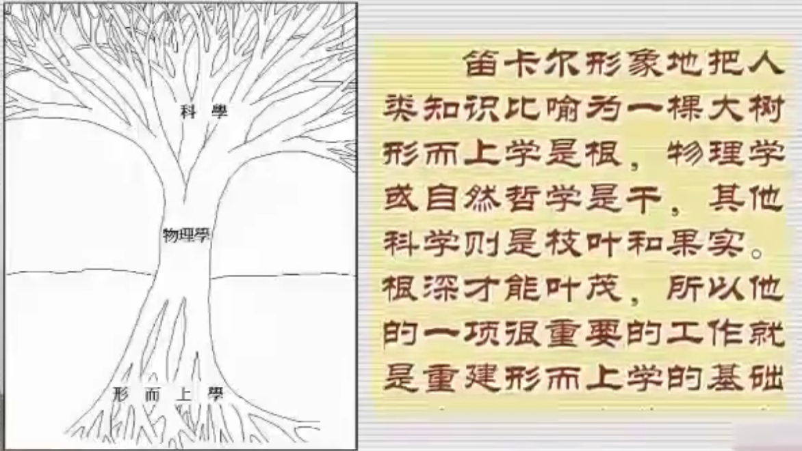
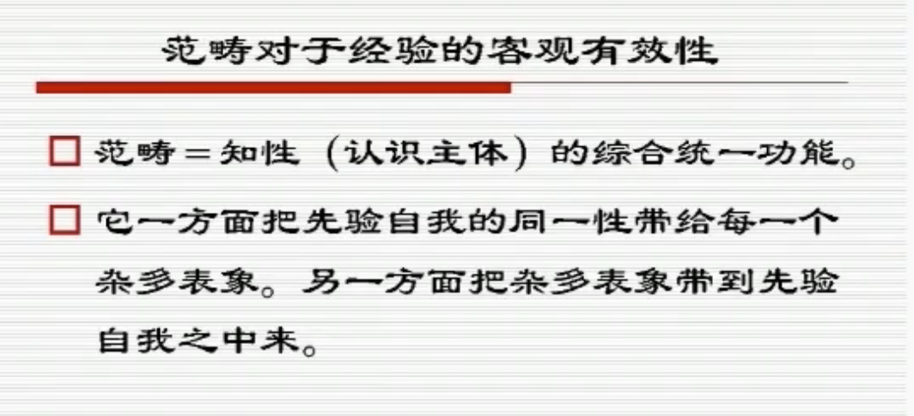
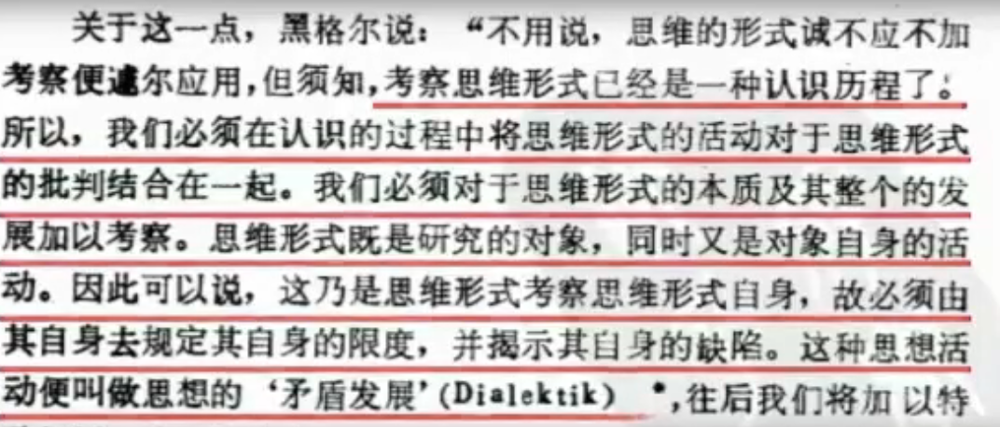

## 近代哲学

新时代的**曙光**：

- 世界的发现    ——    大航海时代
- 人的发现    ——    文艺复兴和宗教改革
- 科学的发现    ——    哥白尼革命、牛顿力学
  改造自然为人类谋福利的观念兴起，使得自然科学飞速发展。

早期近代哲学：经验论和唯理论（笛卡尔）
一般以笛卡尔作为近代哲学的开端者

### 主体性的觉醒——两希传统碰撞中的近代哲学

雅典：希腊文明
耶路撒冷：希伯来文明
希腊哲学重视经验的自然主义和科学精神
基督教哲学重视超验性的形而上学

这些基础就构成了现代哲学在自我意识、主体性的基础上的一些基本主题。也就是意味着，近代哲学不仅关注自然科学的问题，形成了比较系统的认识论和自然哲学的理论，而且也关注超越性的本体论的问题。
这个时期的很多哲学家同时是基督徒，受到基督教的影响更多的体现在形而上学上，但他们心中的上帝不是基督教的那个人格神，更多的体现为一种形而上学的终极原因和存在。

这时的哲学家不断尝试使哲学成为科学
哲学的科学性如何体现？——通过体系性来体现
科学家尽可能的在描述我们面对的这个世界，但哲学家往往更希望给出一个理想的宇宙模型。

文艺复兴使得理性衰落，而科学知识的发展使得人们重新树立起了对理性的信心。
科学知识的发展也给哲学家提出很多问题：
科学之为科学它的普遍必然性和科学性究竟根据何在？于是形成了经验论和唯理论之争。——围绕着**认识论**的问题。

近代哲学的精神：**启蒙主义**
启蒙最根本的核心，就是讲**理性和自由**，让理性成为人的主导和世界的主导，将理性作为最高的权威来取代那个神学的权威。
启蒙主义三大敌人：

- 封建专制制度
- 宗教迷信
- 愚昧落后

**经验论与唯理论**
经验与理性之争自古有之，柏拉图的两个世界使得经验和理性分离对立。但在当时实际上与科学发展密不可分，地心说建立在经验之上，而日心说建立在理性之上。

### 唯理论

#### 笛卡尔

整个近代哲学的自我意识原则、主体性原则由笛卡尔这开始。
经院哲学衰落，自然科学发展，而哲学百废待兴，于是笛卡尔肩负恢复理性地位，重建形而上学的基础，为整个人类知识大厦重新奠定基础的任务。

笛卡尔的思想：

- 方法论
- 天赋观念

##### 方法论

笛卡尔非常推崇几何学，而欧几里得的几何学从几条公理和定义诞生了几百个命题，是一个严密的演绎科学的体系。只要接受他的定义和公理，那么它的每一个命题都是无懈可击的真理。笛卡尔**使用这个方法来构建哲学体系**，找到第一原理，然后严格按照逻辑推演，就能推演出人类知识的整个大厦。
近代科学的发展，数学的演绎科学公理化体系的模型起了非常大的作用，任何一个理论科学一定带有这样一种公理化系统。

笛卡尔并不排斥形式逻辑，但：“旧逻辑只能用来推理分析已知的知识而不能获得新知识。几何学方法能够推演出新知识来但却只研究抽象的符号，而不研究知识。”
笛卡尔认为他的理性演绎法，包括理性和演绎两个部分。
理性：理智直观。方法自身不能给出大前提，需要理性自身提供**第一原理**，笛卡尔称它为理智直观。

笛卡尔要求哲学的基本原理必须满足两个条件：

1. 它们必须是明白而清晰的，人心在注意思考它们时，一定不能怀疑它们的真理；
2. 我们关于别的事物方面所有的知识一定是完全依赖那些原理，可以单独研究原理，但没有原理无法了解事物。这个哲学原理是所有一切东西的前提。
   这样的一个通过理智直观去找到的基本原理笛卡尔称为——天赋观念

##### 天赋观念

根据观念的来源，分为三类：“天赋的”、“从外面来的”和“自己制造出来的”。
这三类观念对应着三种心理功能，外来的观念依赖于感觉，虚构的观念借助于想象，而**天赋观念则出于纯粹的理智**。
天赋观念在笛卡尔这里是一种先验的客观。

笛卡尔提出了一种方法论上的怀疑，是一种**怀疑方法**，区别于怀疑论（以怀疑为目的），是一种以怀疑为方法，找到无可置疑的东西。
笛卡尔认为必须将自己心中一切信以为真且值得怀疑的东西全部清除出去，再从根本上重新开始，找到不容置疑的。

构成笛卡尔形而上学体系的原理：

1. 我思故我在
2. 上帝存在
3. 物质世界存在

##### 形而上学

###### 我思故我在

笛卡尔的形而上学的第一原理。

笛卡尔认为：

- 感觉经验是不可靠的
- 梦境中的一切是不可靠的
- 所有形象都可能是梦境中的东西
- 数学也是可以怀疑的
- 上帝的存在也是可疑的

但有一点确实无可置疑的，那就是“**我在怀疑本身**。”否定了一切，就只剩下怀疑了。

怀疑毕竟是个思想活动，是思想者在思想，于是得出了“我思故我在。”这样的命题。笛卡尔想说的是，思想是我的本质，我思想我就知道我是如何起作用的，我不思想我就不知道有我，不起作用了。我们不可能设想我们没有思想。

“我思故我在”这个命题构成了整个近代哲学的开端。

“我”***是***一个**心灵实体**，这个心灵实体的本质乃是“思想”。

在笛卡尔时代，通过怀疑为哲学寻找无可置疑的基点，可能是唯一可行的策略。
在知识真假难辨的情况下，任何肯定的具有知识内容的判断，都无法确证自身的合理性，只能通过否定的方法。

"我思故我在"是笛卡尔哲学体系中无可置疑的第一原理，笛卡尔由此确立了理性的地位。
即使我无法确证我知识是否真假，但我却可以确定一点，它们都是**我的知识**，以**我**为前提。也就是说我现在确立的是**构成知识的一个逻辑前提**，也就是**一切知识一定以一个主体为前提**。这也就是***主体性的觉醒***

笛卡尔通过怀疑方法确立我思的过程，亦即通过否定性的方式，排除知识内容，最终剩下抽象一般的认识主体的过程，也就是确立主体性的过程。

###### 上帝证明和物质世界存在

“我们通过怀疑的方式确立了我思故我在，但是除此之外我们没有肯定任何东西。
在我的思想中有一个无限完满的上帝的概念。
我肯定不是上帝概念的原因，它一定另有原因。由此我们只能说，在我们之外，有一个无限完满的心灵，它把这种观念赋予我的心灵，所以我有上帝的观念。
就上帝这一表征着最完满的存在的观念而论，显然我不可能是它的原因，它只能源于一个更加完满的本性。所以，我们只能说有一个比我更加完满的存在将这个观念放进我的心灵之中，这个完满的存在就是上帝。
简单来讲，我是有限的，而上帝概念是无限的。
因为欺骗和谬误这些非实在的东西与上帝这样一个绝对实在的完满属性不相符合。如果上帝给予我们的认识能力是贻误人生的，他使我们认假为真，那他就是一个骗子。
现在，我们知道上帝是完满的，因而不可能欺骗我们，于是我们最大的怀疑便连根铲除了。这就是说，由于确信上帝的实在性和完满性，我现在也确信物质世界的存在。“

而如果上帝存在能够证明，那我们对这个世界最大的怀疑，这个世界根本就不存在，那就可以烟消云散了。

所以实际上是曲线救国的证明，由于怀疑，无法直接证明物质世界的存在，只能先通过上帝的证明来证明物质世界。

**身心二元论：**
人的心灵能够思想而没有广延。物体有广延而不能够思想。

**广延**：物体即广延。物体的本质，物体的规定即广延。所谓广延就是具有空间体积的有形体的东西。

**实体**：所谓实体，我们只能看做是能自己存在而其存在并不需要别的事物的一种事物。

在笛卡尔这里，物体和心灵各自独立存在，并不依赖，由此也可以看作是实体。那么这里**必须要有一个上帝在之间建立联系**。

观念的东西与观念关联，物体和物体的东西相互关联，既然是两类，它们之间的关系如何解释？只好超出它们之外，求助于上帝。

确立主体性使笛卡尔称为近代哲学的创始人，然而也引出了二元论的难题。笛卡尔的二元论给近代哲学打上了深深的烙印。

我们要通过我和这个世界区别开，才能确立主体性，但一旦区别开，我再去讨论主体和客体的一致，思维和存在的一致，那就出现问题。因为前提是思想和存在，是两类不同的东西，现在要建立它们的同一性，如何建立，前提就预设了不可能实现这个理想。

**身心交感论**：
笛卡尔早期认为身与心是对立的，无关的，晚期时认为存在一个“编译器”，可以将思想转换为身体指令。

唯理论要从人的心灵中，而不是从外部事物的感觉经验中去推论整个世界。

黑格尔：“思维与存在的关系问题是近代哲学的基本问题。“

#### 斯宾诺莎

 黑格尔："要达到斯宾诺莎的哲学成就是不容易的，要达到斯宾诺莎的人格是不可能的。"
 “斯宾诺莎是近代哲学的重点：要么是斯宾诺莎主义，要么不是哲学。要开始研究哲学，就必须首先做一个斯宾诺莎主义者。"

斯宾诺莎是从实体一元论的角度:一般的哲学是从被创造物开始，笛卡尔是从心灵开始，我则是从神开始。
而斯宾诺莎所说的神，不是宗教的神，不是人格神，而是神圣的必然性。
所以从最高的神圣必然性出发，哲学的最高原则。
认识事物，要么从空间位置关系上认识它，要么事物被包括在神内，从神圣的自然之必然性去加以认识。

斯宾诺莎的哲学有很强的伦理学色彩
斯宾诺莎的哲学体系：

- 本体论——根据（基础）
- 认识论——方式和手段
- 伦理学——最终目标
  斯宾诺莎的作品《伦理学》仿照欧几里得几何学的方式，从定义和公理出发，再到命题，之后还有推论、解说等等，构造了一个哲学体系。
  但数学方法≠哲学方法，在这里表现得非常明显，妨碍了斯宾诺莎表达自己，也带来了读者的阅读困难
  包括实体、属性、样式

##### 本体论

###### 实体

“实体，我理解为在自身内并通过自身而被认识的东西。换言之，形成实体的概念，可以无需借助于他物的概念。”
**实体即自因**。它自己是它自己存在的原因，不能是他因，否则会导致无穷后退。
实体即自因：

- 实体是无限的
- 实体是永恒的
- 实体是不可分的
- 实体是唯一的

**实体=自然=神**
在斯宾诺莎这里，自然≠物质世界，是包括心和物两种东西在内的，是包括自然万物在内的大全。
能生的自然（作为原因的自然）
被生的自然（作为结果的自然）
最初的古希腊哲学中，这两种自然是统一的（古典唯物论），之后在柏拉图这里分离为理念世界（能生的自然）和现实世界（被生的自然）。
而在斯宾诺莎这里，又重新统一了。
自然是自己存在的原因，也是自己存在的结果，实体即自因。这个原因不在自然之外，它作为这个原因，产生了这个世界，这个世界就是他的结果。 **斯宾诺莎认为神不在世界之外，而就在世界之内，即神圣的自然必然性。**

自然神论：
这基本上当时许多科学家和哲学家持有的观点，到休谟才去批判它。以牛顿作为最大的代表。对于一个封闭的宇宙，静者恒静，动者恒动，任何一个事物的运动会推动另外一个事物的运动，进行能量传递，而宇宙中能量守恒。那么需要一个第一动者， 牛顿认为上帝就是那个第一动者。上帝推动这个世界后就不需要管它了，这个宇宙以自己的规律运行了。
另外一个体现是设计论。在宇宙中拥有非常美妙的秩序，我们不能想象这种秩序是一个完全非理性的，那么它也一定有一个设计者。
泛神论：
是不承认有那个人格神的，这个神不在宇宙之外，就在宇宙之内，就在一花一草之中，它就是那个神圣的自然必然性。
斯宾诺莎等于把那个神等同于必然性。让这个神任意的创造世界改变世界，行使神迹就根本不可能。在某种意义上说，泛神论与无神论基本上差不多了。

###### 属性

“属性，我理解为由知性看来是构成实体的本质的东西。”
是实体的本质，但加了个限制，从理智的角度看。从实体的无限的角度来说，它有无限多个属性，但从人所能把握的角度，我们只知道两种，“思维和广延”。
斯宾诺莎将笛卡尔的两个实体（思维、广延）下降为一个实体的两个属性。
同笛卡尔一样，心不是物，物不是心，它们相互之间没有关系，但是因为它是同一个实体的本质，所以它们是同一的一致。
**心物两面论**：我们所知道的事物都有两面，思维的一面和广延的一面，思维只能影响思维，广延只能影响广延，但它们又是一致的，因为它们是同一个实体的两个方面。比如说一个杯子，它既是思维的存在也是广延的存在，占有广延，是一个物体的存在，同时也是一个概念的存在，杯子的概念是观念。

斯宾诺莎认为心和物是一致的，统一于最高实体，反映的是最高实体的本质。

###### 样式

“样式，我理解为实体的分殊，亦即在他物内通过他物而被认知的东西。”
也就是实体的表现，我们所看到的大千世界就是实体的样式。
样式的世界是带有因果链条的世界，相互之间关联，一个事物的存在（在他物内、果），要以其他的存在为前提（通过他物被认知、因）。
斯宾诺莎认为这个样式的世界是个必然性的世界，认为物质界中没有偶然性，偶然性是人们无知的托辞。因为他物要通过他物被认识。
自然从原因的角度看是实体，是能生的自然。从结果的角度看是宇宙，是样式，是被生的自然。但是是一个东西，角度不同。

**实体即自因**
**属性是实体的本质**
**样式是实体的分殊**

我们人也有心的一面和物的一面，我们生活在样式世界，还好我们有心灵，我们想要摆脱这种限制而达到自由的境界，我们要去认识实体，去摆脱样式状态的束缚，通过认识神，认识那个神圣的必然性，而达到那个自由的境界。

##### 认识论

斯宾诺莎将知识分为三类：

- 意见或想象   没有确定性
- 理性知识   需要推理来论证
- 直观知识   对本质的正确认识

直观的知识就是直接从神圣必然性去认识事物。
笛卡尔的天赋观念相当于斯宾诺莎的真观念。
真观念的解释是人的理智就像人的劳动，最开始有一些最原始的工具，这些原始的工具就是真观念，通过这些原始工具创造出复杂工具。通过使用这些原始工具，在思维劳作过程之中会锻炼的越来越复杂。

##### 伦理学

斯宾诺莎伦理学的主要问题是，既然自然中的一切事物都是“他因”的，都受严格的因果必然性的支配，那么作为自然的一部分的人如何可能达到至善的道德境界呢？
虽然人们生活在自然必然性的限制下，但是他的心灵是有可能通过知神、认识神，然后他遵从神圣必然性而活动的这种能力，所以有可能达到至善的境界。
斯宾诺莎认为所谓的至善是真正的善，最高的善，是一经发现和获得之后，便可以永远享受连续无上的快乐的东西。
**至善：就是认识人的心灵于整个自然（非物理的，是实体）相一致。**
至善的境界是通过对神的认识而达到的。

#### 莱布尼茨

莱布尼茨已经意识到他那个时代机械论的宇宙观的问题。他认为哲学面对着两个问题：

- 自由与必然之间的矛盾  ——  任何时代
- 不可分的点与连续性之间的矛盾  ——  当下时代
  莱布尼茨**面对的问题**是：广延可以解释连续性，但是空间是可分的，如果可以无限分割，那么统一性从何而来？当时存在一种原子论的观点，原子是不可分的，原子论下的问题是连续性从何而来？

"数学上的点"是不可分的，但是没有广延，只是抽象思维的产物而没有现实的存在；
"物理学的点"具有现实性，不过它是无限可分的，因而不是具有统一性的实体；
"形而上学的点"是既现实存在又是真正不可分的实体。这种”形而上学的点“就是”单子“。
所谓“单子”就是客观存在的、无限多的、非物质性的、能动的精神实体。
单子的属性：

1. 单纯性
2. 复多性
3. 永恒性
4. 单子之间相互独立
5. 质的区别
6. 单子是自因
   “没有两片完全相同的树叶。”
   普遍差别原则：一切都是有差别的。

那么如何解决不可分点和连续性的问题？
连续性原则：单子可以排序为一个等级顺序，最高级的单子和最低级的单子间有无限的等级，但每两个单子中间有无限多个中间环节。
但是单子是自因，是自动机，是会自己发生变化的，这样无法解释变化的连续性。如果一些单子变化速度不一，也无法解释既定的顺序。
先定和谐： 上帝预定了一切，预定了各个单子的活动，就像交响乐团，整体永远平衡。

偶因论：心身是独立的，上帝时刻协调两者的平衡。
对偶因论的反对：上帝预先给心和身设定了“程序”，让他们一致。这样解释了心身一致问题。

##### 认识论

单子即自因，它携带着过去，孕育着将来，一切都在它自身之中，当然是天赋。
这里的天赋是以一个禀赋的方式、习性或者潜能的方式的潜能在我们心中，人的心灵就像一块有花纹的大理石，在一个艺术家的面前，花纹不同，适合雕的雕像不同。感觉经验起到激发潜能的作用。

### 经验论

唯理论的哲学家们非常注重数学，试图用一种公理化系统的模型来建立一套哲学科学，一种演绎科学。
经验论从经验出发，重视实验科学。以“心理论”的方式构建体系，是“经验——观念——知识”的模式。

#### 洛克

洛克不赞同天赋观念的理论，他认为天赋观念的证明是无法证明的，如果作为知识这种存在方式，存在于何处？对于不信上帝的民族，何处去找上帝带来天赋观念？实际上用不着天赋观念，只需要假定人有认识能力就可以解释。于是提出了“白板说”。
**白板说**：人的心灵就像一张白纸，外部事物刺激心灵，在上面就产生了印痕，这种印痕我们就称为观念，观念最后上升为知识。
经验->观念->知识

人的**感觉器官的两个接收消息的通道**：
外感觉        感觉
内感觉        反省

洛克经验论的**基本原则：一切观念来源于经验**。
**观念**（idea）是洛克哲学中的一个基本范畴，用以表示心灵所知觉、所思想的东西。
观念可分为：

1. 简单观念
2. 复杂观念
   **简单观念**的基本特点是被动性和单纯性。简单观念复合起来为**复杂观念**。
   那么我的感知和外在事物之间有什么关系？
   **第一性的质**：就是物体各部分的大小、形状、数目、位置、运动和静止，也即事物广延的性质。
   第一性的质是事物固有的原始性质。
   **第二性的质**：是指事物本身所具有的一种运动方式在我们的心灵中所引起的感觉。
   第二项的质是附属性质。
   第二性的是主观的，物理的运动引起我的感知，但引起的是主观的反映，在事物中找不到原型。也就是事物的统一性就在于广延，其他的感觉性状不过是我们的主观的一种反映。

知识是理智对于两个观念的契合或矛盾的一种知觉。**知识也就是对于两个观念之间关系的认识**。
观念之间的关系有四类：

- 同和异
- 关系
- 共存或必然联系
- 实在的存在
  心外有物，心中有观念，那么如果我的观念是说从外部事物获得的，那么如何保证我们关于事物的知识和外部事物这个对象是否符合一致？
  对于这个问题，仍是二元论的问题，洛克也只能求助于上帝。
  对于简单观念：证明的基点是感官是被动接受
  感官是被动接受，不是我们创造的，所以各种事物通过自然途径引起我感知的能力，我的心灵也有接受这些刺激的能力。这些能力从何而来，只有上帝。
  对于复杂观念，除了实体观念之外，一切复杂观念都是与自身相契合的。
  **为什么实体观念不能？**
  对于事物，一定有一个载体作为各种属性的依托，这个依托就是实体。
  在洛克这里，感知不到实体，实体更类似于复杂观念，但复杂观念只需要跟自身符合，只跟心灵中的对象有关系，但实体是对外部事物的一个规定，显然是无法证明它。
  我需要假设这个实体，但我不知道它是什么。substance，sub-，在下支撑的。
  也就是说，一切简单观念都是与事物符合一致的；复杂观念在心灵中和自身符合一致。而实体是个复杂观念却要与外部事物符合一致，这是我们无法知道的。

显然，我们存在对观念的遗忘，在范围上，经验 > 观念 > 知识。到了知识这个层面，我们认识的范围是越来越狭小了。在洛克这里，已经有了**不可知论**的因素在里面，在某种意义上，**这是经验论的一个逻辑的结论**。

对于一切知识来源于感觉经验，有两个问题出现：

1. 我只知道经验，但经验究竟从何而来？我能不能超出经验去知道，引起经验的那个东西？
2. 如何解释普遍性和必然性？

#### 贝克莱

洛克的经验论一定会导向怀疑论，也就会导向无神论。贝克莱的做法是将那个物拿掉，所以他致力于的一项工作是非物质主义。
贝克莱认为，我们在知识中就两个因素，即感知观念的心灵和被心灵感知的观念。
在认识中，就是一个主体和一个客体，在认识中的那个客体，不是外部事物，是我们心中的观念。
推理：

- 观念的存在即被感知。
- 物 = 可感物 = 观念的集合
- 物的存在即被感知。

贝克莱说他之所以用“观念”而不用“事物”，是为了反对心外有物的唯物主义。贝克莱不是想把事物变成观念，而是想把观念变成事物，即维护观念的客观实在性。
贝克莱并不是说把一切事物变成我们每个人自己主观的，唯我论，感知就存在，不感知就不存在。

观念的存在即被感知和感知
证明过程：
因为这个世界上的事物是观念，所以心灵才能感知这个世界。如果是纯物质的存在，心灵怎么可能感知一个与心灵完全不同的物质存在？因此，一定有一个伟大无限的心灵，创造了这个观念的世界，也创造了我们有限的心灵，使我们能够感知这个世界。

在他这里，观念是一种客观实在，心灵来感受它。
那么能否论证上帝存在作为外部这个观念世界的根据？如果说一切知识来源于感觉经验，那么经验从何而来的问题，使经验自己无法解决的。怎么判断观念和心灵都是上帝创造的？

#### 休谟

将经验原则贯彻到底，最彻底的经验主义者，结论自然是怀疑论。
康德认为：“自从有形而上学以来，对于这一科学的命运来说，它所遭受的没有什么能比休谟所给予的打击更为致命。”

知觉：

- 观念
- 印象
  相当于一个是思想观念，一个是感觉印象。
  休谟称自己是温和的怀疑论，只对感觉经验的来源保持怀疑，而对经验范围之内的事情能说清楚。知识来源于经验，不可能超越于经验，两者之间总有经验的帷幕。
  其实更偏向于不可知论，承认某些东西是不可知的，而怀疑论是对一切都怀疑。

人类理智的对象可分为：

- 观念的关系
- 实际的事情
  知识可分为：
- 关于观念的知识   ——必然的知识
- 关于事实的知识   ——或然的知识

关于观念的知识：因为与外部事物无关，只要自身符合它的逻辑就没问题。“即使宇宙中不存在三角形，欧几里得的几何学仍是正确的。”并不依赖与有没有三角形，凭逻辑来判定真假。

或然的知识：建立在感觉经验之上，事实之上。在休谟看来，牛顿力学是或然的知识。对于相对偶然的经验重复一万次也是相对偶然的，感觉经验只对已经经验过，和当下正在经验的东西有效。

休谟问题      ——归纳问题
黑天鹅问题表明，一切归纳不能下全称判断。建立在经验观察基础上只能是或然的推论。

那么为什么会将牛顿力学作为普遍必然的科学？
休谟认为，它是建立在因果观念的基础上。在所有的原则里，只有因果观念使人们超出经验去下判断。
休谟对因果律的置疑：

- 只看到结果，没看到原因，就无法推论产生结果的必然是这个原因。
- 只看到原因，也无法推论一定会产生一个那样的结果。
  休谟认为：
- 从纯粹理性的角度是不可能做必然的因果推论的。一个事物的因果关系绝不是理性先天的就能推出来。
- 经验也不可能必然地推论因果。
  对于一对因果A和B，总是经验到一个东西出现，另一个随之出现，经验到它们之间的所谓必然联系了吗，没有，只是表面。
  那么所谓的因果观念究竟从何而来？
  因果观念：来源于习惯性联想
  有点像心理学中巴甫洛夫效应。
  他说：“习惯是人生的伟大指南。”如果没有习惯，我们每次看到都是新的事物，没有所谓的规则与规律。

一个知识要么在逻辑上的重言式，能够通过矛盾律去判断真假的，要么是经验的知识，能有经验的证实，除此以外什么都不是。

罗素：“休谟是”英国经验论的逻辑终局。“，经验论的必然结果，也必然产生怀疑论。

### 政治哲学

这部分不是很想记，但可以记一下卢梭的思想。

#### 卢梭

他采取了一种与人们完全不同的方式解释社会契约，与自然状态之间的关系。
"**人生而自由，却无往而不在枷锁之中**。"
回溯到人的自然状态，去除所有的社会性，这是个逻辑的假定。卢梭把“人所形成的人”即社会人与自然人加以比较，来说明人类社会的基础和不平等的起源。
人身上的自然本性就是一种自我保存，人就像游荡森林里的狼一样，相互之间是偶然的，**人和人之间没有关系**，虽然个体有生理差异，男女、力量强弱，但不在社会关系之下，是没有意义的，用不着去比较。

“使人文明起来，而使人类没落下去的东西，在诗人看来是金和银，而在哲学家看来是铁和谷物。”
自然状态不可能持续太久，人需要生存，要利用自然去维持生机，形成了农民、渔夫等私有制。
卢梭认为劳动使人拥有了土地产品的权利，然后就拥有了土地本身。
我所劳动的付出和对土地的占有导致了私有制的产生，但这与人的自然权利冲突，他人不会认为我土地上的劳动成果是我应当占有的，自然中的东西每个人都有权获得它，这样就产生了冲突。于是有产者欺骗无产者来维护自己的利益，建立一个权利，这种状态催生出了一种社会契约，导致了社会制度的出现，这个出现导致了不平等的加剧。现在有了国家，有了社会权力，有了统治者和被统治者，不等进化到极致，那统治者会认为国家归我所有，其他一切皆奴隶。
卢梭等于在跟启蒙思想家唱反调，启蒙思想家认为人只要大胆的使用理性，提倡科学和知识进步，社会就会向进步的方向发展。卢梭给出一个相反的答案，社会越发展越不平等。
卢梭不仅将社会状态与自然状态对立，还显现出了对自然状态的美好描述。但卢梭不是要回到自然状态，而是说是否能找到一种社会制度不以自由平等的牺牲为代价，进入到社会状态下还能有平等和自由呢？
《社会契约论》中说，合理的社会契约其要旨就在于“每个结合者及其自身的一切权利全部都转让给整个的集体“。在这个集体里，既是统治者也是守法者，是一种民主共和国的方式，每个人的权利都是一样的。
法律和制度制定的依据是**公意**，将众意中减去相异部分而剩下的相同部分。任何人拒不服从公意的，全体就要强迫它服从，对卢梭来说，这就等于说“迫使他自由”。

我们可以思考，是否能在现实中创造这样的共和国？不依靠法律，而依靠每个人将自己的权利转让出来，自行当家作主，我们每个人既是立法者也是守法者，既是统治者也是守法者，靠公意来维持这样一个存在？
在康德的伦理学中有一个想法，立法和司法真正能统一起来，只能在道德理想当中，现实中不太容易实现。

在我看来，通过卢梭的思想可以窥见，在私有制的社会制度下，在拥有自然本性的人们对于不平等的不满是一种必然，进而共产主义思想的诞生也是一种历史必然。

卢梭的思想影响到后来的法国大革命。在法国大革命雅各宾专政的时期，对当时的红色恐怖，黑格尔说：“砍一个人的头，跟砍一颗白菜喝一口凉水差不多。“我们会想，革命就是造反，革命总有成本，必然会威胁到一些人的安全，历史车轮总要撵倒一些小草，总会有牺牲，但历史车轮的前进，方向错误自不必说，如果那个方向是正确的，是不是它一定要以牺牲他人生命为代价，如果牺牲的还是无辜的生命，是否存在问题？
在我看来，革命有正当性，但恐怖没有，而方向的正确与否，只能在未来评价，这反而有些悖论。

### 康德

”哲学在历史上参与了时代精神的塑造，虽然它确实十分晦涩。“
德国古典哲学的书是有了名的难读。

德国古典哲学创始人。

康德生下来身体非常不好，他生下来之前的男婴全死了，他的母亲千方百计想激发起康德的生存欲望，求知欲望，但康德活了80岁。
他从很年轻的时候就给自己制定了一套非常严格的作息制度，严格的向钟表一样。他周围的邻居靠康德什么时候下来散步来对钟表。对康德思想最有影响的是卢梭和休谟。
康德一辈子没有离开自己的家乡戈尼斯堡，但博览群书，什么都知道，虽然独处一生，但经常参加社交活动。虽然“循规蹈矩”，但给我感觉应该是很有意思的一个人，他去世时，整个城市的人为他送行。
康德46岁在申请教授论文发表后，被划定为批判时期。康德的批判哲学来自于最重要的三部著作：《纯粹理性批判》、《实践理性批判》和《判断力批判》。

老师认为：康德哲学是现代哲学的开端，黑格尔哲学是古典哲学的终结。实际上是黑格尔之后，他这条路没人走了，所以是终结，而后面的路与康德有千丝万缕的联系。

#### 康德哲学的问题

- 理性的危机
- 自由的失落
- 形而上学名存实亡

在唯理论和经验论的哲学下，实际上证明科学知识的普遍必然并没有成功。
启蒙最重要的指导思想是理性和自由，摆脱人们对思想的束缚，理性解放，追求自由。而在一切领域都可用自然法则说明下，自由失去了存身之地。
休谟的怀疑论、18世纪法国的无神论建立在经验基础上，形而上学名存实亡。
**这三个问题在康德这里集中体现为知识的问题**。理性的问题要证明科学知识的问题，自由的问题是因为把科学精神贯彻到所有领域里面，自由反而失去了，形而上学如此也是因为想成为科学但没有成为。

休谟的提示打破了康德的独断主义的迷梦。
独断主义：没有对理性的认识能力进行深入的考察，就武断断定的哲学理论。

启蒙带有一种知识分子精英要教化大众的历史使命，而卢梭说进入到社会状态社会越发展人越不平等，科学各方面的进步不足以是人们提高道德水准。 那么究竟什么能够体现人的价值和尊严？在启蒙思想中更提倡的是知识，而卢梭更提倡是**道德**。

> 我过去认为唯有知识能够造福于人类，所以我以有知识为荣，鄙视那些无知的人们，但是卢梭纠正了我的偏见，教会了我尊重人。

将康德的问题集中为一个问题：**在一个严格受自然法则限制的世界上，人有没有自由？有没有不同于其他自然存在物的价值和尊严？**

**康德认为形而上学体现的是人类理性试图超越自身有限性，通达自由境界的一种理想。**
从这个角度考虑，是形而上学成为科学与这个理想背道而驰，**让形而上学达到最高的普遍性和必然性能不能解决形而上学的理想，这是康德的“哥白尼革命”的实质问题**。

#### 康德的“哥白尼革命”

康德同一经验论的基本原则，一切知识来源于感觉经验，但经验不够以说明普遍性和必然性，但科学知识又是存在的，如何说明？
科学知识至少包含两方面的因素：一方面是后天经验，另一方面是先天形式。对于那些先天的知识是具有普遍和必然性的，而对于后天经验知识是或然的。

在这里，康德对于“先天”的概念发生了变化。
后天的：

- 个别偶然的
- 感觉经验的
  先天的：
- 普遍必然的
- 独立于经验同时作为经验的条件

经验论与唯理论的困境：如果知识必须建立在经验的基础之上，知识就不可能有普遍必然性；如果知识有普遍必然性，它就必须是先天的，而不可能是后天的，来源于感觉经验。
康德将这个问题特别的表达：我们如何能先天的经验对象。

在传统的思路上，真理必须符合对象，这种真理的符合论无法解决问题。
如果真理必须符合对象，我无法解释外部事物如何进入到我们头脑中来；即使外部事物及其属性可以进入到我们头脑中，也无法解释普遍性和必然性。
那么能不能像哥白尼一样，颠倒主体和客体的关系，不是知识必须符合对象，而是对象必须符合认识主体的**先天认识形式**。
康德认同经验论的基本原则：一切知识来源于感觉经验。但是仅仅有感觉经验还不够，**主体自身需要有一套加工整理感觉经验的认识形式和结构**。人的心灵不是像洛克说的就是一张白纸，而是**有一套自己的认识形式和结构。**
我们的认识形式不来源于感觉经验，是主体自身的，这套认识形式就是所谓独立于经验同时构成经验条件的东西。
构成知识要两方面的因素，一方面是感觉经验，一方面是主体的认识形式对感觉经验加工整理，这样获得的知识既具有经验内容，又被整理出了普遍性和必然性。
从内容上讲，知识是经验的、后天的。
从形式上讲，知识是先天的。
**是认识主体赋予知识先天性。**
康德的特殊之处在于，将认识形式类似于一套认识工具而不是天赋观念的知识，只要去认识，就要使用工具，大家使用的工具是一样的，结果也是一样的。

只能看到你先天认识形式所能看到的，涉及形式范围之外，事物究竟自身如何，我们永远无法知道。物自体不可知。
事物对我们的**显现**，我们可以形成科学知识，但在这个东西之外，事物究竟是什么样子，我们无从得知。就是**物自体**究竟什么样，不可知。
这样，解决了普遍性和必然性的问题，但带来了**不可知论**。
形而上学的理想在这里遇到了严重的挑战，宇宙万物的终极原因是无法实现的。

虽然认识形式的限制体现了认识能力的有限性，但是另一方面物自体不可知也表明在我们的认识领域之外还有一个不受认识形式限制，因而可能是**无限自由的领域**。
那么**自由就有了可能**性，人类理性的实践理性就有了用武之地。
人类理性的两大功能：

- 理论理性 -> 认识能力
- 实践理性 -> 伦理、道德
  不可知论是个消极的结果，但正因为不可知，**自由才是在逻辑下可能**的。如果它是可知的就没有自由，会在认识形式的限制之下。那么以自由为前提的道德伦理学就有其可能性。

**哥白尼革命实际上做的是划界，同时让自然哲学和道德哲学都能成立。**
即使我们能够证明人类可以认识物自身，那也无法解决自由的问题。更何况我们无法证明我们能够证明物自身。
恰恰是这不可知论给自由留有余地。形而上学要满足的是人达到自由境界的理想，要让他成为科学无异于南辕北辙，既然形而上学要超越自身的有限性达到自身的理想，我们也需要满足它，那么能实现人的自由的只有伦理学，科学的领域只能达到必然性。

> 我必须限制知识，以便为信念留地盘。

###### 历史影响与地位

康德对形而上学的批判是最系统的最有利的批判，但不是舍弃形而上学，按照传统的方式走，形而上学不可能达到自己的目的。
人同时是两个世界的成员，同时受两种法则的影响，一方面作为有限的存在是自然的一份子，在这个领域自然法则起作用，一切都是必然的没有自由。另一方面人不仅仅是自然存在物，人还有理性，应该服从理性的法则。但自然法则是必须遵守，无法违背的必然法则，但理性法则是应该遵从但不必然遵从的法则。理性法则就体现为道德法则，应该如何去做。

> 人之为人在于理性。
> 人不是单纯的理性存在，而是有限的理性存在。

康德解决了两方面的问题，一个科学的普遍性必然性，另一个是自由、道德和形而上学的问题。

问题在于，如何证明人有这个认识形式？康德将这一方面作为需要对理性它的能力进行分析和考察，康德将这种**分析和考察叫做批判**。
康德就是要考察一下理性究竟有哪些先天认识形式，对一般形而上学的可能性或者不可能性的裁决。**真正要解决的问题是形而上学的问题**。
批判是和独断论相对的。从此之后，批判几乎成了西方哲学的前提。
康德对理性认识能力的批判形成了三大批判组成的哲学体系（批判哲学）：

- 《纯粹理性批判》     认识能力
- 《实践理性批判》     实践理性
- 《判断力批判》     沟通理论理性和实践理性的一个桥梁

#### 康德哲学

归根结底，是启蒙主义出了问题。
工具理性——价值理性之间的冲突。
科学高速发展，信仰衰落，但问题在于理性能不能取代上帝空出来的那个位置？
尼采认为一切建立在神学基础上的价值崩溃，如果还这么去做无法解决虚无主义的问题，绝对价值的丧失。
尼采与康德面对的是同样的问题。
我们当今也面对同样的问题，物质条件极大丰富，是否它的丰富能否解决我们的精神问题？反而现在人陷入了价值多元化，道德相对主义，人的精神找不到依托。实际上，这就是我进入哲学的原因。
如果接受不了尼采的方式，那么可以看看康德的方式。

我们需要了解康德对于先天认识的存在证明。
康德把人的理性的认识能力区分为三个**环节**：**感性、知性、理性**。
注意：不是过程，是静态的条件、结构分析。

康德强调知识是由判断构成的，**知识的基本单位是判断**。
比如说：地球是行星。

判断分为两大类：

- 分析判断
- 综合判断
  分析判断：指判断的宾词原本就蕴含于主词中，是从主词之中抽出来的。
  没有给我们带来新东西，说的原来就是那个概念所包含的。比如说：苏格拉底是人。
  康德说这种判断的确是先天的，具有普遍性和必然性的，但是它不是严格意义上的知识。
  综合判断：指的是宾词是后来通过我们的经验加在主词之上的。
  比如说：物体是热胀冷缩的。
  综合判断可划分为：
- 后天的综合判断
- 先天的综合判断
  后天的综合判断是单纯的经验判断，不具有普遍必然性。而对于科学知识，要求有普遍性和必然性，就得是先天综合判断。
  先天综合判断如何可能？康德将这个问题具体化为三个问题：
- 纯粹数学如何可能？——先验感性论
- 纯粹自然科学如何可能？——先验分析论
- 一般形而上学如何可能？——先验辩证论
  实际上问的是构成一个科学知识需要哪些基本条件，找到这些基本条件后可以用它来判定一门知识是否是科学知识。

先验哲学：研究先天认识形式的科学
超验：指的是那个物自体，超越于经验之外的不可知的领域
他相信形而上学有两个方面，一方面是对自然的描述，另一方面是超越于它之外，给这个宇宙一个终极的原因，超越的原因。
康德认为我们描述世界的逻辑结构是可以成立的，但不是亚里士多德意义上的自然本身的逻辑结构，而是我们认识世界的结构，是我们主体的认识形式和结构。而超出这个领域之外，是不可知的领域。

人类理性的两大功能：
理论理性——认识能力
实践理性——行动、意志功能

人的认识能力分三个环节：感性、知性、理性

纯粹理性批判分为：

- 先验感性论
- 先验逻辑论
  - 先验分析
  - 先验辩证

先验逻辑与形式逻辑相对，形式逻辑只是处理已经有的知识，只关注于形式方面的逻辑关系，并不关注于知识内容。比如说：上帝是万能的。在形式逻辑上是合乎逻辑的，但在事实上不关注。
在形式逻辑分析的知识背后，我们要有起认识论作用的逻辑，这里的认识论是先天认识形式。
先验分析论——关于真理的逻辑
先验辩证论——关于假象或幻想的逻辑
先验感性论——研究感性先天的直观形式

感性就是直观，当我们和对象发生关系中间不经过任何中间环节直接发生关系，在康德看来，我们只有一种直观能力，就是感性直观，康德坚决反对人有理智直观。

##### 先验感性论

**空间和时间是感性的先天直观形式**。
这一点是康德的独创，和我们通常的感觉经验和意识观念大相径庭，在我们看来这个世界就存在于空间之中，而康德说空间和时间不是外部事物的存在方式，而是我们看待事物的方式。
康德的证明分两类：

- 形而上学的阐明            要证明空间和时间是先天直观形式
- 先验的阐明           这个先天直观形式构成了经验的先决条件

形而上学的阐明：
空间与时间是感知事物的先决条件，而不是感知的结果。以空间为例，如果要感知外部事物，就已经以空间为前提，不可能感知不在空间中的事物。
空间与时间是不是通过感性经验而获得的经验概念。不是经验了许多个空间，然后得出一个空间的概念，而是只要感觉发动，就一定以空间为前提。人的直观能力、空间感是先天的。所以**空间是直观不是概念**。概念总是有很多个个体，不可能想象一个概念涵盖无限多的个体，在形式逻辑中，概念有一个内涵和外延的关系：内涵越少，外延越大。如果想象一个没有内涵的东西，那他就不是概念了。而空间只有一个，不同空间是整体空间的部分，并且是无限的。
如果时间和空间是先天直观形式如果证明了，他们对经验的客观有效性也就证明了，因为构成了经验的先决条件。
康德要说明数学问题。
康德认为数学可以分为几何学和算数。几何学就是关于空间的科学，算术就是关于时间的科学，必须把它们看作是先天综合的判断。
比如说两点构成一条直线，包含了量和质的关系。5+7=12，只分析5和7怎么也得不出12，只有将他们加起来才能得到12，它们的关系最基本的是时间上的前后相继。如果不是将时间和空间看作先天直观形式，无法解释几何学和算术的普遍性和必然性。
当然，康德的物理知识和数学知识对于现代来说落后了，但我们将他解决问题的方式和意义剥离出来：
**即使在感觉经验之中我们也必须考虑到主体的认识形式**。
用一种大而化之的话说，我们每一个人都是站在自己的立场观点方法看待世界，每个人看到的世界会有区别，不同的文化看待世界有不同的立场观点方法。
对于感性，空间和时间构成了经验的两个通道。

##### 先验分析论

知性的先天认识形式是“知性纯概念”。亦即“范畴”。
感性认识和理性认识的结合问题，在康德这里着手解决。

> 感性之所司在直观，知性之所司在思维。直观物概念是盲的，思维无概念是空的。

康德强调感性与知性结合才能形成知识。要有感性直观提供的材料，要有知性提供的范畴作为认识工具。
康德通过形式逻辑论证知性范畴。四组十二个范畴就是我们知性的纯概念、先天认识形式。
康德关注的问题：
知性范畴对于经验的作用。
按照通常观念，感性提供对象，主体是认识的对象。而康德要证明没有知性范畴就没有经验。所以康德将这个证明称为先验演绎，这是个法学上的概念，要区别事实与权利的区别。康德要检查这个概念范畴的合法性依据，也就是**范畴应用于经验的客观有效性**。**证明范畴是经验的先天条件**。
这部分的证明是最困难的。
康德证明的先决条件：

- 感性直观
- 先验自我
  感性直观和自我是两种不同的能力。感性直观提供经验杂多，自我自己不能直观，自己不能给自己提供经验内容。

**形成知识需要综合**。综合是两个不同表象的连接，综合不可能来源于物自体，它不可知，也不可能来源于感性，感性是被动的接受，只是提供给我们表象的杂多，综合就是知性，唯一要归于知性的自发性。
康德关于范畴的演绎核心命题是：**我思必须能够伴随着我的一切表象**。
否则，我的表象不为我所知就不是我的表象，只要在我认识之内，我的一切感觉经验、认识和情绪，所有的活动都以我为前提，所以**我与我自身的同一性是最高原理**。而表象不是自我提供的，是由感性提供的，就意味着我们需要解决同一的我和杂多表象之间的关系，怎么将这些杂多的表象变成我的表象，而**我思和感性直观是两种不同的认识能力**。我思行使认识的功能，感性行使直观的功能，我们要解决同一的我和杂多表象的多之间的关系，要把杂多表象变成我的表象，而我是同一的，表象是杂多的，是一对多的关系，而杂多表象能进入我的意识中来，就一定要成为我的杂多表象，说明我们要在我和杂多表象中找到一个中间环节，可以把杂多表象带到同一的自我之下来。
范畴对于经验的客观有效性，范畴体现的就是自我的综合统一功能，范畴一方面把杂多表象带到自我中来，另外一方面把自我的同一性带给每一个杂多表象，才能说我思伴随着我的一切表象。

感性和知性怎么沟通？
**先验的想象力(头脑中形成图像的能力)**。 感觉经验面对这个图像，在感性直观中起作用，形成一个图像就需要综合，将不同属性连接，综合起来所需要的规则却是范畴的规则。**提供综合的规则只有范畴**。所以想象力介于知性和感性之间，在感性中实施的是范畴的作用。
形成你的认识对象是有认识活动参与其中的，只不过是盲目的在感性直观中起作用，我们不知道，我们再去认识它，我们发现范畴不只是知识的形式，也是对象的形式。来源于同样一个根源，**知性范畴的综合统一规则**。

最高原则：**知性为自然立法**。
康德说得“自然”并不是自然本身，而是一切可能经验之表象的总和。表象作为经验就要符合连接表象的规则，**连接表象的法则是知性的法则，亦即范畴，因而“知性为自然立法”。**
亚里士多德：范畴是体现存在的意义。
康德：范畴是认识世界的工具。
所以在康德这里，形而上学要能解释这个世界就有可能了，考虑到人的认识世界方式，内在形而上学是可以成立的。在现象界可知，而且可以形成科学知识，超出经验之外，不可知的领域。

我们的认识从感觉经验开始，通过和知性范畴结合形成判断，但是人类理性不满足于此，它希望我们的知识能够构成更大的体系，能够使我们所有的知识形成完满的体系，这就需要理性的作用。
理性是进一步把知识调整为体系的作用。可以理解为对于知识的知识，而如果将理性作为认识的对象，问题就出现了，形而上学犯的就是这个错误。
感性的先天认识形式是空间与时间。——接受性
知性的先天认识形式是范畴——构成性
理性的先天认识形式是理念——调整性
理性的三个理念：灵魂、宇宙、上帝
三个理念体现的是理想的统一性：

- 灵魂主观世界的统一性
- 世界万物的统一性
- 上帝大全的统一性
  将他们作为目标引导知识进步是有意义的，但加入把它当作现实的统一性要去认识它，就会陷入到幻象之中。

> 幻象是混淆了理想的统一性和现实的统一性。

就认识而言，离开了经验不可能有有效的知识，而形而上学是超验的。
传统形而上学分三部分：

- 理性心理学——灵魂
- 理性宇宙论——世界
- 理性神学——上帝
  **二律背反**：
  宇宙中的东西都是可以经验的，但宇宙不是一个经验，将宇宙作为对象，会形成两种相反的理论，但它们各自都能够自圆其说。
  对同一个对象形成两种矛盾的理论，但是各自又都能成立，就是“二律背反”。
  第一组二律背反：
  世界是无限的还是有限的？
- 正题——世界在时间上有开端，在空间上有界限，世界是有限的。
- 反题——世界没有开端也没有界限，它在空间和时间两方面都是无限的。
  **第三组二律背反：**
  自由和必然的关系问题
- 正题——仅仅以自然因果律解释自然是不够的，有必要引入自由因。
- 反题——没有自由，世界是按照自然因果律解释的，一切是必然的。

康德说这对二律背反产生的原因是将宇宙当作一个整体，陷入到矛盾中。如果用哥白尼革命把世界对我们区别为：物自体和现象，这个矛盾可以解决。在现象界有知性的先天认识形式范畴立法，一切都要服从于因果律，没有自由因的问题。将现象背后的物自体看作为不再有原因的原因是说得通的。在现象之内服从自然因果律，引起现象，在现象之外看作是用不着再找原因的原因。

> 我们不可能真正认识到宇宙有自由因，我们只是思想上的逻辑假设。但是在人身上发现有一种可能性，它有自由因，有绝对开始行为的一个原因，用不着找因的原因，即“人有应该”。
> 自然既不可能引起一个“应该”，也不可能制止一个“应该”。

康德理论的核心批判：“关于上帝存在的本体论证明”。
上帝的问题是纯然的超验，完全理想的东西。
**批判的核心：**
**判断的逻辑必然性和事实的现实必然性两者之间的区别。**
关于上帝存在的本体论证明混淆了逻辑必然性和现实必然性。康德举了个非常有名的例子：我头脑中的100块和口袋里的100块有区别吗，逻辑上没区别，但是如果我到商店去买东西，区别就体现了。

在哲学史上，康德对形而上学的批判是最深刻、最系统和最全面的。

##### 实践理性

在近代哲学中，康德是把实践范畴引入哲学的第一人，不过他所说的实践还只限于伦理学的范围。在黑格尔到马克思是将实践作为改造世界的活动。
自然法则是不得不遵守的必然的法则。理性法则是人应该遵从但不一定遵从的法则。
康德的伦理学是典型的**动机论**。在当时存在一种将道德归结为功利主义的思想，从效果的角度来衡量。而康德认为，从结果或者行为本身来判断，不能辨别一个行为是否具有道德意义。 比如说一个诚实的行为可能有很丑恶的动机。**只有因为诚实而诚实的行为，才能称之为道德行为**。而现实中是否存在这种道德行为？
康德认为，道德行为在现实中没有并不意味着理想中不应该有。**对于理性，恰恰要创造的是自然中没有，但是应该有的东西，这是体现人的价值和尊严的地方**。

道德法则如何可能？
**道德就是说你的主观准则不仅对个人有效，而是对一切有理性者都有效，这样的行为叫道德行为**。
所以有一个关系：

一个道德行为一定是落在个人身上的，个人的动机一定出于主观准则的意义，当你的主观准则对所有理性者都有效时，那就可以称为客观法则。或者说将客观法则作为个人的动机。

康德将道德法则也叫做定言命令。
所谓“假言命令”是一种有条件的命令式。如果……就……，手段和目的是分开的。
**道德命令目的与手段是统一的。这类命令即定言命令**。
**如果一个法则可以叫做道德法则，应该具备的条件**：

- 普遍性的公式
  - 要只按照你同时认为也能成为普遍规律的准则去行动。你的行动，要使你的准则通过你的意志上升为普遍的法则。
- 质料公式（如何判定一个主观准则的内容可以上升为普遍法则）
  - 你的行动，要把你自己的人格中的人性和其他人格中的人性，在任何时候都同样看作是目的，永远不能仅仅看作是手段。（**人是目的，不是手段**）
    实践的功能是目的性的活动，如果一种动机能够成为所有有理性者的动机，意味着能够成为所有有理性的目的，那只能是理性自身。源出理性自身目的而行动，才能叫做不是手段而是目的。衡量的标准也就是动机怎么能成为对所有有理性的奏效，这个行动的目标，考量一下能不能对所有有理性者来说都是它们的目的。如果符合，那我就是出于理性自身而行动，**理性为自身立法**。
- 自律性公式
  - 每个有理性者的意志的观念都是普遍立法意志的观念。每个有理性的存在，在任何时候都要把自己看作是一个由于意志自由而可能的目的王国中的立法者。
    我出于自身目的而行动，我自己立法，我自己遵守。自由就是出于自身内在必然性而行动，自由就是自律，自由和道德法则是一而二、二而一的，是同一个东西。

康德不会把自由理解为任意的去做什么，往往在这样的自由背后会发现利益的原因，经验的原因，欲望的原因，什**么情况下才有真正的自由？那就是出于自身内在必然性**。
**人类理性有两大先天立法权：**

- **知性为自然立法**
- **理性为自身立法**
  对于实践理性和理论理性，康德强调的是实践理性的优先地位。因为不可能让理论理性去统帅实践理性，那样意味着没有自由。但在人身上有一个动机出发，作出一个行为，行为落在现实中是不必然的条件所限制，动机超越于经验条件的限制，但行为是受到经验限制的。
  那么问题在于如何协调两个领域的行为和动机的关系？康德把它具体化为实践理性的二律背反。
  将自然存在物的幸福为目标和实践道德领域的道德为目标两者间的关系如何协调？
  二律背反：
- 幸福是获得德行的原因
- 追求德行的实现也能带来幸福的结果
  以幸福为目的不一定是德行的行为。而追求德行不一定会获得幸福：好人受苦，恶人当道。
- 德行是配享幸福的首要前提；
- 在此前提之下，能享受到幸福，此为至善。

实践理性的“公设“：

- 意志自由
- 灵魂不朽
- 上帝存在
  意志自由，能够将主观准则上升为普遍法则，有这个自律道德才是可能的。
  康德认为人的一生都会受到自然法则的限制，在有生之年都不可能达到完全的德行那个境界。除非假设人格具有无限的延续，否则我们不可能实现德行。灵魂不朽才能实现德行。而灵魂不朽是必须假设的，这样我们才能追求德行。
  必须假设上帝存在能保证两个世界的协调一致。但是康德没有要把道德建立在上帝的这个基础之上，在康德心目中，没有建立在神学基础上的道德，但可以有建立在道德基础上的神学。

在实践理性的最后，康德有一段话脍炙人口：

> 有两样东西，我们愈经常愈持久地加以思索，它们就愈使心灵充满始终新鲜不断增长的景仰和敬畏：在我之上的星空和居我心中的道德法则。

头上的星空和内心的道德法则都和我们的生存密切相关，地球和浩瀚无垠的宇宙连起来在一起，我们生存的地球不过是浩瀚银河中的一粒沙尘，我们也只不过是生活在沙尘上微不足道的生物，我们不知道为什么有了生命，但再过几十年我们又会将生命还给自然，敬畏头上的星空感受到的是人的渺小。人的内心的道德法则，自律，就使我和一个超感性的一个理智的世界一个自由的世界发生了关系，那么人的价值和尊严就体现在这个方面。

康德哲学意识到了近代哲学启蒙主义中理性和自由的冲突，或者说科学和道德和自由的冲突，而康德的解决的方式弥补了启蒙主义的理性概念。启蒙主义的理性主要是科学理性，但康德这里讲要把实践理性加进去，而且把实践理性体现为人的价值和尊严的东西，科学发生的信仰动摇，那么人的精神方面由谁来负责。近代的发展这个社会越来越合理化组织化，却会带来非理性的结果，价值理性基本被工具理性所取代。

**康德哲学的局限性**：
康德自觉的从二元论和不可知论出发，但他绝对不想把二元论和不可知论贯彻到底。但康德自己已经无法解决这个问题了，晚年的康德已经无能为力了。后来的费希特、谢林和黑格尔就要解决康德这个二元论的问题。

### 黑格尔

黑格尔对法国大革命的同情和赞赏保持终身，说：”法国大革命是人类历史上一次光辉灿烂的日出。“
康德哲学在当时对年轻人的影响非常巨大。

> 朝霞伴随着康德升起，自由贯彻全部哲学而始终。——谢林
>
> 人类自身像这样地被尊重就是时代的最好标志，它证明压迫者和人间上帝们头上的灵光消失了。——黑格尔

但后来人显然面对康德的二元论和不可知论的问题。
黑格尔的主要著作：《精神现象学》、《逻辑学》、《哲学科学全书纲要》和《法哲学原理》。其他的都是讲演录。后两本是纲要、教材，主要的书就只有前两本。

> 谁若想理解黑格尔，只能靠他自己。
> 有多少研究黑格尔的人，就有多少个黑格尔。

对于我们来说，阅读黑格尔存在一个解释学循环的问题：不把他读完不了解他的精神，如果不了解他的精神又怎么读他的东西。所以黑格尔的东西的确难读。黑格尔的辩证法给人们理解留下了充分的空间，他要按照事物自身辩证运动的方式来描述这个世界，黑格尔只是描述，让事物自身运动呈现，不看到最后不了解黑格尔的思想。

康德对形而上学的批判造成了形而上学的崩塌，但康德没有很好的建立起形而上学，黑格尔要做起这个工作。
黑格尔对康德的回应：
康德要求对理性进行批判亦即分析是有道理的，但批判本身是不是理性活动？
因此**真正的批判应该是理性的自我批判**。但这种批判如何可能？	黑格尔也是从知识和对象的关系入手，如果承认知识和对象是有差别的，我们用不着超出知识范围之外去检查，在知识范围内就可以检查我的知识和我的对象是否一致，如果它们有区别，显然我要改变知识符合对象。但是改变知识后，对象也会变化，所以我们的认识活动就构成了知识和对象的矛盾运动，因为它们的差别，构成了意识的自身矛盾运动，**认识是一个发展的过程**，根据知识改变对象，根据对象改变知识。感性的对象是感觉经验，理性认识的对象是事物的本质，从感性认识上升到理性认识，从感性认识上升到理性认识是知识发生变化，对象也从简单的感觉经验上升到了对事物的本质的认识。
康德是一个静态的结构分析，而黑格尔是一个动态的发展过程，那也就意味着物自体在发展过程之中逐渐转化为被我们认识到的东西。

上面还只是局限于认识论上，但在认识论上挑战康德是很难的，黑格尔更重要的一点是**统一认识论和本体论**。
**黑格尔相比之前主客体的分析站在一个更高的层面，不要把我们和这个世界分离开来看待，我们就在世界之中**。
人就是这个宇宙的产物，人的活动必然和宇宙有关，如果人没有认识到世界，站在世界的角度我和这个世界发生了矛盾，那么如果我认识了这个世界，扬弃了这个矛盾，不仅仅发生在主观范围内的事情，其实是这个世界本身的发展和变化。
从这个角度看人类的精神活动，那么人类对宇宙的认识就不单纯是人作为主体看待这个世界，你就存在于这个世界之中就是宇宙的产物，人对世界的认识就可以看作是世界的自我认识。
黑格尔的哲学最伟大的地方在于，**黑格尔的哲学立场比其他哲学家要高**。
《精神现象学》展示的过程就是从最基本的感性认识一直进展到对那个绝对精神的认识。在某种意义上，黑格尔心目中来讲，人类精神其实在黑格尔心目中就是那个宇宙万物那绝对精神的具体体现，黑格尔把宇宙看作是绝对精神的展现，而宇宙的展现最高阶段是人类精神， 而人类精神对宇宙的认识，其实就是在替绝对精神做的一项工作，对宇宙的自我认识。

##### **实体即主体**

实体是活的，黑格尔称为活的实体，自身具有能动性。

- 只有当我们把实体同时也理解为主体，理解为自己展开自己的运动的时候，才能说明它的现实性；
- 实体作为主体的能动性就表现在它自身之中就包含着纯粹的否定性；

实体自身带有自己否定自己的否定性，把自己一分为二，展开为对立面，把潜在的东西展开为这个自然，然后发展到人类精神这个层面去认识这个自然，重新达到自身的同一性。

- 实体的运动就成了以终点为目的的自己展开自己、自己完成自己的”圆圈“。
  目的和目的的实现的一个目的论的过程，最初的存在是潜在的东西，展开为自然，最终达到人类精神认识的这个自然，更高层面的重新回到了自身。
  绝对精神——人的精神的绝对化
  但绝对≠绝对精神
  绝对还没有成为精神，潜在的，展开为外在的自然，只有通过人类精神的活动，绝对才真正成为绝对精神，这就意味着人类意识这个世界的活动是参与到了宇宙的本体论里面去了。**从绝对到绝对精神是一个自我运动、自我发展、自己实现自己的过程**。
  黑格尔的宇宙观：就像一颗树种长为大树，一颗树种蕴含着成为大树的所有因素，但是那颗树种在没有长成大树之前，它只能是潜在的大树，只有当它长成参天大树的时候，我们才说它成为真正的现实。黑格尔哲学不会强调真理，只会说是发展的过程，到结果才真正成为现实。

##### **辩证法**

黑格尔认为当时的人类生活在抽象的观念之中，因此很难体验和再现事物活生生的生命。
”辩证的否定“乃是黑格尔辩证法的核心。

> 否定性是毁灭的力量，但唯独有一种东西能在毁灭中仍然保持生命，那就是精神。

黑格尔的哲学前无古人后无来者，后人不再做这个工作了。
黑格尔哲学是古典哲学淋漓尽致的发挥，也是古典哲学最后的生命力。

黑格尔把宇宙看为一个合理性的存在，是个统一的整体，这个统一的整体具有完美的这个秩序，是由一个统一的东西展开的一个现实，那黑格尔哲学就是真理。可惜的是这些都被我们所质疑，我们说这个宇宙是盲目的，非理性的，我们看待世界是我们看待世界的方式，世界本身是个盲目的存在，就意味着黑格尔的那个古典哲学的根基发生动摇。
所以对于黑格尔哲学，我们就当艺术品去欣赏他。
黑格尔哲学的很多思想已经成为人们的共识，融入后世的哲学思想中。但黑格尔给古典哲学画上了句号，既是完成，也是终结。后世探讨形而上学的方式与古典哲学完全不一样了。
